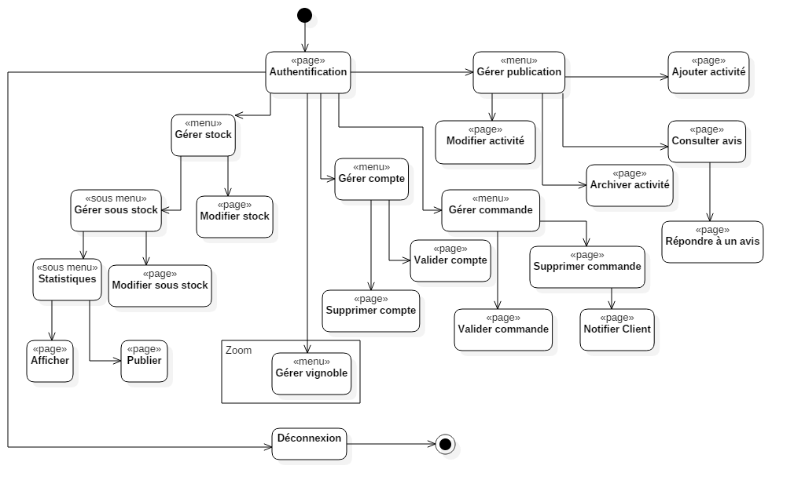
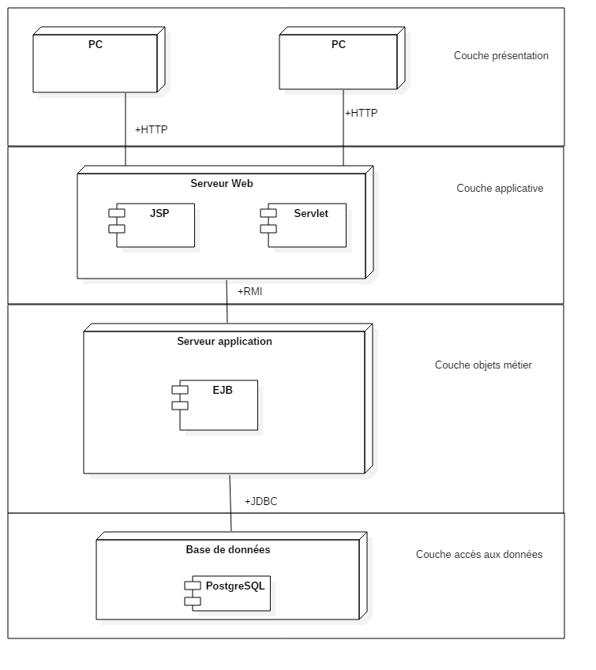

------------------------------------------------------------------------

STRUCTURATION ET MODÉLISATION D’UN SYSTÈME D’INFORMATION : Le vignoble de Suresnes
==================================================================================

------------------------------------------------------------------------

 

Zakaria Ait-Omar 
Clémentine Chasles 
Nisrine Drissi 
 
**Master 2 TSI 2015-2016** 

*Responsable :* M. Emmanuel Bardière 

14 janvier 2016

INTRODUCTION
============

Pour le projet de « Structuration et Modélisation d’un Système
d’Information » réalisé du 23 Novembre 2015 au 14 Janvier 2015, nous
avons fait le choix de prendre pour thématique la viticulture. En effet,
notre étude porte sur le vignoble de Suresnes, dans les Hauts-de Seine.
L’intérêt du projet fut d’appliquer nos connaissances en modélisation et
en gestion de projet, afin de proposer une solution adéquate aux
éventuels besoins et souhaits des représentants de la vigne.

Ces derniers n’ayant aucun applicatif à ce jour pour la gestion des
pieds de vigne, du stock ou encore de la vente des bouteilles de vin,
nous avons orienté notre travail en répondant à la problématique
suivante : **quel système d’information est le plus adéquat à un
vignoble de petite taille, qui n’utilise à ce jour, pas
l’informatique ?**

Ainsi, notre étude présentera un état des lieux du vignoble, avec ces
différentes caractéristiques et ses principaux acteurs. Par la suite,
nous détaillerons la solution proposée dans le cadre de ce projet en
utilisant UML. Enfin, nous verrons quelles sont les limites recensées
tout au long de notre travail, ainsi que les perspectives et
améliorations possibles de notre applicatif.

Tables des matières
-------------------

-   [INTRODUCTION](#introduction)
-   [Analyse de l’existant](#analyse-de-lexistant)
    -   [Présentation du vignoble](#présentation-du-vignoble)
        -   [Histoire de la vigne de
            Suresnes](#histoire-de-la-vigne-de-suresnes)
        -   [Diagramme de cas d’utilisations de
            l’existant](#diagramme-de-cas-dutilisations-de-lexistant)
    -   [La vinification](#la-vinification)
    -   [Le fonctionnement de l’équipe de
        projet](#le-fonctionnement-de-léquipe-de-projet)
        -   [La gestion de projet](#la-gestion-de-projet)
        -   [La recherche documentaire](#la-recherche-documentaire)
        -   [L’environnement de travail](#lenvironnement-de-travail)
-   [Solution proposée](#solution-proposée)
    -   [Conception de la solution](#conception-de-la-solution)
        -   [Grands choix techniques](#grands-choix-techniques)
        -   [Besoins fonctionnels](#besoins-fonctionnels)
        -   [Besoins techniques](#besoins-techniques)
        -   [Base de données](#base-de-données)
        -   [Diagramme de classes](#diagramme-de-classes)
    -   [Mieux connaître le vignoble](#mieux-connaître-le-vignoble)
    -   [Un SI à destination des
        internautes](#un-si-à-destination-des-internautes)
        -   [Commander une bouteille de
            vin](#commander-une-bouteille-de-vin)
        -   [Manipuler la cartographie du
            vignoble](#manipuler-la-cartographie-du-vignoble)
    -   [Une meilleure gestion
        administrative](#une-meilleure-gestion-administrative)
        -   [La gestion du stock](#la-gestion-du-stock)
        -   [Authentification et
            inscription](#authentification-et-inscription)
    -   [Architecture](#architecture)
        -   [Navigation des acteurs sur l’application
            web](#navigation-des-acteurs-sur-lapplication-web)
        -   [Architecture de la solution](#architecture-de-la-solution)
-   [Limites et perspectives](#limites-et-perspectives)
    -   [Limites et contraintes
        d’utilisation](#limites-et-contraintes-dutilisation)
        -   [Le passage à l’informatique](#le-passage-à-linformatique)
        -   [La multiplicité des rôles](#la-multiplicité-des-rôles)
        -   [Limite d’un use-case : la gestion des
            commandes](#limite-dun-use-case-la-gestion-des-commandes)
    -   [Perspectives et améliorations du
        SI](#perspectives-et-améliorations-du-si)
        -   [Drones](#drones)
        -   [Un support important de
            communication](#un-support-important-de-communication)
-   [CONCLUSION](#conclusion)
-   [Annexes](#annexes)
    -   [Compte-rendu : Rendez-vous avec Monsieur Jean-Louis Testud et
        Catherine Magdelaine, à la Mairie de
        Suresnes](#compte-rendu-rendez-vous-avec-monsieur-jean-louis-testud-et-catherine-magdelaine-à-la-mairie-de-suresnes)
    -   [Compte-rendu : Visite de la vigne de Suresnes par Guillaume
        Descroix](#compte-rendu-visite-de-la-vigne-de-suresnes-par-guillaume-descroix)

Analyse de l’existant
=====================

Présentation du vignoble
------------------------

La vigne de Suresnes est le plus grand vignoble d’Île de France, où 4500
pieds sont répartis sur 1 hectare. Il s’agit du seul vin ouvert à la
vente, avec environ 5000 bouteilles produites par an. Pour en comprendre
les caractéristiques, il est important d’en comprendre l’histoire.

### Histoire de la vigne de Suresnes

Dès le IXème siècle, la vigne est présente en Île-de-France sur les
collines et les plateaux et notamment à Suresnes sur le Mont-Valérien.
Pendant plusieurs siècles, le vin de Suresnes est réputé et plébiscité
par les Rois de France, dont François 1er et Henri IV. On dénombre au
XVIIème 64 vignerons sur une vingtaine d’hectares, ainsi que 30
bourgeois qui se partagent 40 hectares de vignes. Le rude hiver de 1709
détruit de nombreux cépages, puis la construction de la ligne
Paris-Versailles en 1839 finit d’altérer le vignoble. Ce dernier est
aussi fortement affaibli par les parasites tels que le mildiou et
l’oïdium. Ces différents facteurs de diminution de la vigne expliquent
donc qu’en 1950, le vin de Suresnes ne soit produit que par un seul
vigneron dénommé Robert Joyeux. Pourtant en 1926, le Maire de Suresnes
créé une vigne municipale, « Le Pas Saint-Maurice » sur les lieux d’une
ancienne carrière. Cette vigne municipale fut abandonnée peu après suite
à un manque d’entretien.

Le Pas Saint-Maurice renaît suite à un ré-encépagement en cépages blancs
sur 70 ares en 1965. Dès lors, la municipalité entreprend d’importants
travaux, notamment la construction d’une cave moderne à l’endroit même
de la vigne.

Aujourd’hui, un vigneron professionnel s’occupe spécifiquement de la
culture de la vigne et de l’élaboration du vin, sous le contrôle d’un
laboratoire œnologique. L’association Le Clos du Pas Saint-Maurice a été
conventionnée par la Mairie de Suresnes pour s’occuper de l’entretien de
la vigne, de l’élaboration et de la commercialisation du vin. Une
administratrice est quant à elle chargée de la gestion des ressources,
c’est-à-dire de l’association, de sa comptabilité et du stock de
bouteilles. Chaque année, la récolte oscille entre 35 et 60 hectolitres.

Grâce à ces informations, nous avons réalisé un diagramme des cas
d’utilisations. Il permet de mettre en évidence les différents acteurs
et les principales actions réalisées au sein du vignoble.

### Diagramme de cas d’utilisations de l’existant

La vinification
---------------

Le vigneron de l’association Le Clos du Pas Saint-Maurice effectue
plusieurs tâches et suit un processus bien précis pour produire le vin
blanc de Suresnes. Dans ce chapitre nous décrivons toutes les étapes
essentielles avec tous les indicateurs nécessaires. Le diagramme
d’activité a été choisi pour synthétiser la démarche de vinification,
car il permet de représenter les processus interactifs. Le diagramme
ci-dessous présente les grandes activités exercées dans le vignoble et
qui sont effectuées par le vigneron et en incluant les différents
tests :

Le fonctionnement de l’équipe de projet
---------------------------------------

### La gestion de projet

Notre équipe a essayé de gérer le projet en respectant la méthode Agile
**SCRUM**. En début de projet, nous avons réfléchi au sujet et listé les
fonctionnalités que nous souhaitions développer en plusieurs grandes
features. Puis, nous avons détaillé chacune d’entre elles en user
stories, avons attribué à chaque user story une priorité et un nombre de
points, pour finalement en faire un backlog de référence. Ce backlog
contenait 81,5 points. Le projet s’étendant au départ sur 10 jours en
salle projet, 3 sprints ont été définis pour que ce dernier soit achevé
plus ou moins à la fin de ces 10 jours. Voici le détail de la backlog de
référence.

### La recherche documentaire

Pour réaliser notre projet en UML, nous nous sommes largement appuyés
sur le cours de **Pierre Gérard, professeur à l’université de Paris 13 -
Villetaneuse : *Introduction à UML2, Modélisation Orientée Objet et de
Systèmes Logiciels*\
([http://www-lipn.univ-paris13.fr/~gerard/docs/cours/uml-cours-slides.pdf](http://www-lipn.univ-paris13.fr/~gerard/docs/cours/uml-cours-slides.pdf))**.
De même, nous avons puisé sur l’internet bon nombre de ressources pour
nous aider dans l’utilisation correcte des **standards d’UML2**. Voici
une liste non exhaustive d’exemples de liens :

-   [http://www.uml.free.fr](http://www.uml.free.fr)

-   les tutoriels recommandés sur le site [http://www.uml.org](http://www.uml.org)

-   Puis, pour compléter la visite du vignoble de Suresnes et mieux
    comprendre le principe de vinification, le site très complet de
    l’Institut Français de la Vigne et du Vin
    ([http://www.vignevin.com](http://www.vignevin.com)) nous a aidés,

-   ainsi qu’évidemment le site de l’Office de Tourisme de Suresnes\
    ([http://www.suresnes-tourisme.com/patrimoine-vitivinicole.html](http://www.suresnes-tourisme.com/patrimoine-vitivinicole.html)).

-   Nous avons aussi trouvé des exemples de logiciels viti-vinicole
    commercialisés pour voir ce qu’il se faisait déjà dans ce domaine :
    il est à noter Lavilog ([http://www.lavilog.com](http://www.lavilog.com)).

### L’environnement de travail

Notre équipe a réalisé les diagrammes avec les logiciels **ArgoUML** et
**StarUML**. Nous avons créé un dépôt sur Github pour centraliser les
données du projets et échanger.

=&gt; [https://github.com/nisdrissi/Modelisation](https://github.com/nisdrissi/Modelisation)

La gestion de projet a été faite sur un tableur LibreOffice. Le rapport
a été rédigé en **markdown**, puis via **Pandoc**, a été convertit en
**LaTeX** puis retouché et adapté dans **Texmaker**. Enfin, depuis
**Texmaker**, il a été convertit en PDF.

Solution proposée
=================

Conception de la solution
-------------------------

La gestion de vignoble est depuis plusieurs années considérée comme un
domaine traditionnel géré par des gens qui ont de l’expérience dans la
vinification. Ainsi, l’enjeu prioritaire des gestionnaires de l’
association du Clos du Pas Saint-Maurice réside en partie dans
l’adaptation d’un système d’information qui répond à un environnement en
continuelle évolution. Cependant, le déploiement d’une gestion de
vignoble dans l’ association doit être mûrement réfléchi. Il convient au
préalable de définir clairement les étapes et les objectifs de la
vinification et du vignoble. Ce processus a fait l’objet de la démarche
de gestion que nous avons proposée. D’autre part, les systèmes
d’information de gestion du vignoble qui secondent cette démarche
mettent à la disposition des vignerons et managers de l’ association de
véritables outils d’aide à la décision, et se veulent utiles à tous les
niveaux du processus de vinification et de vente du vin blanc. Notre
projet vient dans ce sens et se fixe ces mêmes objectifs adaptés à la
vision stratégique de l’ association. Dans notre système nous allons
identifier tous les pieds de vigne avec leurs positions dans le vignoble
à fin de garantir un suivi interactif sur une carte déployée sur notre
application.

### Grands choix techniques

Dans le but de conduire un projet réel et de produire une application
web de qualité qui répond aux besoins de l’ association dans des temps
et des coûts prévisibles, il est nécessaire de choisir une méthode de
développement et de déploiement. UML est un langage graphique qui permet
de représenter, de communiquer les divers aspects d’un système
d’information avec des textes associés aux graphiques explicitant leur
contenu. Il permet ainsi, de passer du modèle au système de manière
lisible et argumentée. Lisible, car pour faire évoluer le système, il
faut pouvoir faire le lien entre les objets du domaine et les objets du
système. Argumentée, car les choix techniques sont complexes,
indépendants et doivent être périodiquement révisés pour tenir compte de
l’évolution des environnements. Java Entreprise Edition, ou Java EE, est
une spécification pour la technique Java de Sun plus particulièrement
destinée aux applications d’entreprises. L’implémentation de cette
spécification contient un ensemble d’extensions au framework Java
standard (JSE, Java Standard Edition) afin de faciliter la création
d’applications réparties. Le choix de cette technologie est justifié,
d’une part par la maturité et la richesse de cette dernière et d’autre
part, par la gratuité de la solution car il s’agit d’une technologie
Open Source.

### Besoins fonctionnels

Cette phase consiste à recueillir les différents besoins fonctionnels et
techniques qui seront traduits dans notre système par un ensemble de
fonctionnalités et de technologies. La première étape de cette phase a
pour objectif de définir les fonctionnalités correspondantes aux besoins
implicites des dirigeants de l’ association grâce aux deux rendez-vous
que nous avons eus, alors que la deuxième étape consiste à expliciter
ces besoins en termes de technologies et d’outils à utiliser, afin de
répondre aux besoins fonctionnels en prenant en considération le budget
d’une telle association.

Notre projet consiste en la conception et le développement d’une
application web pour la gestion du vignoble de Suresnes. Elle devra
permettre de couvrir les volets suivant :

-   **Gestion du vignoble**: permet de gérer les données concernant
    l’ensemble des étapes de la vinification à fin de produire le
    vin blanc.

-   **Gestion de stock**: permet de renseigner pour l’association l’état
    du stock de leur production.

-   **Gestion des commandes** : permet de gérer toutes les commandes et
    ventes du vignoble.

-   **Gestion des profils** : permet de définir les rôles des grands
    acteurs qui vont réagir avec notre système. Ces profils ainsi
    définis, représentent des profils types requis par chaque fonction
    dans l’association.

Nous avons découpé ces volets en six use cases attribués chacun à
l’acteur correspondant dans le diagramme ci-dessous :

 

### Besoins techniques

L’architecture en couches est la conséquence inévitable d’une approche
qui s’appuie sur la réalisation de composants réutilisables. Dans le but
de réaliser un système évolutif et modulaire, l’architecture adoptée est
une architecture en couches qui garantit le maximum de découplage entre
les couches logicielles mises en œuvre. Elle a ainsi les propriétés
suivantes :

-   Une couche ne communique qu’avec ses deux couches
    voisines immédiates.

-   Une couche délègue à la couche inférieure le travail qu’elle ne
    prend pas en charge.

-   Une couche retourne à la couche supérieure son résultat.

Ainsi, une architecture n-tiers (architecture 4 tiers) a été adoptée.

### Base de données

Dans cette partie sera établi le modèle statique du système en
présentant des tables candidates avant de projeter la partie
fonctionnelle de l’application sur son architecture logicielle selon les
couches qu’elle présente, à savoir : **la couche présentation**, **la
couche applicative**, **la couche objets métier** et **la couche accès
aux données**.

-   **Vignoble** : C’est la classe associative qui rassemble toutes les
    tables et qui référence notre vignoble à une année bien précise.

-   **Utilisateur**: Fait référence aux comptes de tous les profils qui
    vont utiliser notre application.

-   **Bouteille** : C’est la table qui décrit notre produit essentiel.

-   **Stock** : Il s’agit du nombre de bouteilles qui existe dans
    notre vignoble.

-   **Commande** : C’est une table associative dans laquelle on précise
    qui a fait la commande de quoi et à quelle date.

-   **Cuve** : Il s’agit d’une table dans laquelle on stock tous les
    éléments nécessaires à chaque étape de la vinification.

-   **Parcelle de vigne** : Fait référence à toutes les parcelles qui
    constituent le vignoble.

-   **Pied de vigne**: Désigne les caractéristiques de tous les pieds de
    vigne du vignoble dès la mise en place de l’application.

Le diagramme ci-après illustre les différentes tables en spécifiant les
interactions entres elles :

### Diagramme de classes

Le diagramme de classes de l’application représente les différentes
relations et liaisons entre les classes candidates du système appelées
aussi objets persistants. Le diagramme ci-dessous illustre les
différentes classes qui vont constituer notre système :

Mieux connaître le vignoble
---------------------------

Le vigneron a la possibilité de **gérer** et d’**analyser** son
vignoble, d’avoir des statistiques précises pour chacun des pieds qui
compose son domaine. Ainsi, la solution propose d’entrée des critères
comme par exemple la cuvée, la parcelle ou encore l’année de plantation
du pied. Tous ces critères lui permettent de croiser les informations
pour avoir une visibilité plus fine des difficultés ou des points forts
de sa vigne. L’application détermine, selon les critères sélectionnés,
quelle est la représentation graphique la plus pertinente pour
l’affichage des résultats. Le vigneron a ensuite une option d’export des
résultats en fichier PDF.

Un SI à destination des internautes
-----------------------------------

### Commander une bouteille de vin

L’internaute visite la page “Production du vin” de l’application web qui
le renseigne sur le processus de vinification une fois les vendanges
faites. Il souhaite ensuite acheter du vin. Seul l’achat au vignoble est
possible notre solution ne proposant pas la vente en ligne et la
livraison.

Pour finaliser son achat une fois la bouteille commandée via
l’application, l’utilisateur vient retirer sa bouteille tel que décrit
dans le diagramme de séquence ci-dessous :

### Manipuler la cartographie du vignoble

L’internaute arrivant sur l’application web est directement dirigé vers
la page d’accueil qui affiche une carte du vignoble. Cette carte est
faite à partir de Leaflet et contient plusieurs couches (les coordonnées
x et y, les pieds de vignes, le vignoble). S’il n’est pas identifié et
qu’il sélectionne un pied de vigne sur la carte, il se trouve confronté
à l’impossibilité de consulter les informations du pied de vigne
sélectionné. Le diagramme de séquence suivant détaille cette situation.

Une meilleure gestion administrative
------------------------------------

La solution proposée permettra également à l’administrateur de gérer le
stock de bouteilles de vin plus facilement. Il y a aussi la possibilité
d’avoir une liste à jour des utilisateurs de la solution.

### La gestion du stock

En effet, le système d’information propose à l’administrateur de gérer
de manière plus précise le stock destiné aux commandes effectuées sur
l’application web. L’application tient compte des ventes réalisées les
années précédentes pour déterminer quel est le meilleur nombre de
bouteilles de vin à dédier au site, comme le montre le diagramme de
séquence suivant.

L’administrateur peut ainsi consulter le stock actuel, l’analyser ou le
modifier. Dans ce scénario, le vigneron décide d’analyser son stock,
afin de savoir où il se situe par rapport aux stocks des années
antérieures. Il obtient un pourcentage du nombre de bouteilles vendues.
Suite à cela, l’applicatif lui fait une proposition en regard du stock
actuel.

À noter, que le stock en question est celui dédié aux commandes
réalisées sur l’application, et non le stock général qui comprend les
bouteilles vendues dans la cave ou lors des différentes manifestations
extérieures (foires, festivals, etc).

### Authentification et inscription

La solution informatique permet également à des internautes de
s’inscrire sur le site pour avoir accès à certaines fonctionnalités,
notamment la commande de bouteille(s) de vin et la manipulation de la
cartographie des pieds de vigne.

Une fois inscrit, l’administrateur doit valider la création du compte,
en vérifiant que les champs saisis sont corrects, notamment le nom,
prénom, adresse et numéro de téléphone. Cette vérification avant la
validation finale du compte utilisateur permettra d’éviter les
« fausses » commandes ou les comptes « doubles ». Également, cela
permettra une modération pour les personnes n’ayant jamais retiré leur
commande, évitant donc qu’elles puissent commander à nouveau.

Architecture
------------

### Navigation des acteurs sur l’application web

#### L’utilisateur

L’acteur **utilisateur** dispose de plusieurs fonctionnalités portant
notamment sur la consultation et le suivi des activités de
l’association. Afin d’avoir une vision concrète sur l’accès qu’il a vers
ces fonctionnalités, la figure ci-dessous a été réalisée :

#### L’administrateur

L’application offre à l’acteur **administrateur** plusieurs
fonctionnalités se rapportant à la gestion du stock et à la gestion des
profils ainsi qu’à la gestion des différentes publications et activités
de l’association. L’enchaînement des pages offrant ces fonctionnalités
est bien illustré par le diagramme de navigation présenté sur la figure
suivante :

#### Le vigneron

Afin d’éviter l’encombrement du diagramme de navigation de l’acteur
**vigneron**, et pour une meilleure lisibilité, un cadrant intitulé
« Zoom » n’a pas été détaillé sur ce même diagramme. La figure ci-après,
fait un zoom sur cette partie du diagramme de navigation qui concerne la
gestion du vignoble :

### Architecture de la solution

L’architecture adoptée est une architecture en couches qui sépare
distinctement les **quatre couches** suivantes :

#### Couche présentation

**La couche présentation** fait l’interface avec l’utilisateur. Sa
première tâche est d’afficher les données qu’elle a récupérées auprès de
la couche accès aux données. Sa seconde tâche est de recevoir toutes les
actions de l’utilisateur (clic de souris, sélection d’une entrée,
boutons, …). Ses différents événements sont envoyés à la couche
applicative.

#### Couche applicative

**La couche applicative** joue le rôle principal dans la synchronisation
de la couche présentation et de la couche accès aux données. Elle reçoit
tous les événements de l’utilisateur et enclenche les actions à
effectuer. Si une action nécessite un changement de données, c’est cette
couche qui possède les outils pour demander la modification des données
à la couche accès aux données et ensuite avertir la couche présentation
que les données ont changé afin que celle-ci se mette à jour. Certains
événements de l’utilisateur ne concernent pas les données mais la couche
présentation elle-même. Dans ce cas, elle demande à la couche
présentation de se modifier.

#### Couche objets métier

**La couche objets métier** est représentée par l’ensemble des entités
persistantes de l’application. Ces entités représentent les Entity Bean
pris en charge par EJB. Ils possèdent entre autres les propriétés
suivantes :

-   Ce sont des objets qui savent se mapper dans une base de données.

-   Ils utilisent un mécanisme de persistance.

-   Ils servent à représenter sous forme d’objets des données situées
    dans une base de données.

-   Le plus souvent un objet = une ou plusieurs ligne(s) dans une ou
    plusieurs table(s).

#### Couche accès aux données

La couche accès aux données assure la gestion des données de
l’application et garantit leur intégrité. Elle offre des méthodes pour
mettre à jour ces données (insertion, suppression, changement de
valeur).

**Définitions** :

-   **Les servlets** : Une servlet est un programme java déployé sur un
    serveur web chargé automatiquement dans le serveur ou à la demande
    d’un client. Une fois déployée, elle reste en attente des
    requêtes clients. Elle génère dynamiquement des données sous format
    de pages web (format HTML ou XML)

-   **Les JSPs** : Ce sont des composants permettant de générer
    dynamiquement des pages web. Le modèle JSP est dérivé du
    modèle servlet. À l’appel d’un client, le serveur web appelle le
    moteur JSP pour générer le code source, le compile pour générer
    l’exécutable de la servlet qui traite la requête.

-   **EJB Reçoit**: l’information de l’application la traite et met à
    jour les données stockées dans le “tier” gestion des ressources ; il
    récupère l’information stockée, la traite et renvoie le résultat de
    ses traitements au client.

Limites et perspectives
=======================

Limites et contraintes d’utilisation
------------------------------------

Le système d’information proposé répond à certaines contraintes dans la
gestion globale du vignoble et apporte des fonctionnalités inexistantes
auparavant. Néanmoins, il instaure également des limites, principalement
dues à la presque non-utilisation de l’informatique par les acteurs de
la vigne.

### Le passage à l’informatique

Dans un premier temps, le passage à l’informatique risque d’être
complexe. En effet, cela demande du temps pour la formation, pour la
numérisation des données et pour que les personnes s’habituent à
utiliser la solution au quotidien.

Cela risque ainsi de bouleverser le rythme actuellement en place et
pourra, au début, sembler être une perte de productivité plus qu’autre
chose. Ainsi, l’applicatif risque de demander des efforts importants
dans la phase d’installation pour le vigneron et l’administrateur, et
sera pleinement utilisé à moyen terme.

### La multiplicité des rôles

Également, comme le montre le diagramme des cas d’utilisation de
l’existant et de la solution, certains acteurs portent plusieurs rôles
simultanément. Le vigneron pourra avoir accès à l’intégralité de
l’applicatif, dont la gestion de stock ou la gestion des commandes par
exemple, tout comme l’administrateur. Cela nécessitera une coordination
au préalable de ces deux acteurs pour éviter des modifications qui
pourront être lourdes de conséquence comme par exemple sur le stock ou
le contrôle des inscriptions. Ce chevauchement pourrait éventuellement
être résolu par une restriction des accès au vigneron, notamment en ce
qui concerne la gestion de l’application.

### Limite d’un use-case : la gestion des commandes

Enfin, la solution porte également certaines limites, dont l’une qui
concerne la gestion des commandes. Comme le montre le diagramme de
séquence, l’utilisateur a la possibilité de commander des bouteilles de
vin, selon ce qui est proposé par l’application web. Dès lors que la
commande est validée et son statut de confiance correct, un e-mail lui
est envoyé pour lui faire part des horaires auxquels il peut venir
récupérer ses produits à la cave. La vente est donc « à emporter » avec
un paiement sur place, limitant le nombre de clients potentiels à
Suresnes et les communes voisines, au mieux, à l’Île-de-France.

Ce choix de ne pas proposer un paiement en ligne avec une livraison par
la Poste découle du constat réalisé sur place à la cave. En effet, le
vigneron étant seul et présent uniquement deux jours par semaine, la
préparation des colis risque de lui prendre du temps et donc de réduire
celui consacré au soin de la vigne et à la vinification. De plus, cela
nécessiterait un investissement financier supplémentaire que
l’association n’est peut-être pas prête à faire.

Perspectives et améliorations du SI
-----------------------------------

Au-delà de ces limites, certaines perspectives sont envisageables à
court, moyen ou long terme pour rendre le système d’information plus
efficace pour la vigne de Suresnes.

### Drones

L’une des perspectives d’amélioration de l’outil proposé consiste à
utiliser des drones pour la prise d’images aériennes pouvant être
interprétées.

Elles pourront faire l’objet d’un traitement d’image pour calculer des
indicateurs comme par exemple le NDVI (Indice de Végétation par
Différence Normalisé). Cela constitue un ajout de métadonnées précises
pour chacun des pieds de vigne.

### Un support important de communication

La solution étant une application de type web, elle constitue un support
de communication fort et accessible à tous. Au fur et à mesure,
l’administrateur pourra, s’il le souhaite, ajouter des manifestations
culturelles auxquelles l’association Le Clos du Pas Saint-Maurice
participe, sous la forme de publications dans une page « Actualités ».

D’autre part, la vigne de Suresnes pourra décider de la mise en place
d’un paiement en ligne et d’une livraison à domicile des bouteilles de
vin, augmentant ainsi ses ventes.

Ces différents aspects pourront permettre une amélioration de la
reconnaissance du vignoble comme étant un lieu vivant de la ville de
Suresnes, représentant ainsi son dynamisme et son attachement au
patrimoine.

CONCLUSION
==========

En somme, le projet « Structuration et Modélisation d’un Système
d’Information » a permis la mise en place d’un modèle pour
l’implémentation d’un SI répondant à des critères spécifiques liés à la
viticulture.

Il aura pour principales ambitions une meilleure gestion des pieds de
vigne, avec des analyses de données très fines permettant au vigneron
une gestion des risques plus efficace. C’est aussi un outil de gestion
administrative avec un recensement automatique des utilisateurs inscrits
et la possibilité de gérer le stock de bouteilles de manière plus
efficiente.

Enfin, cette solution est un outil de communication pour la Mairie de
Suresnes et constitue une façade interactive et innovante pour le
patrimoine viticole de la commune.

Annexes
=======

Compte-rendu : Rendez-vous avec Monsieur Jean-Louis Testud et Catherine Magdelaine, à la Mairie de Suresnes
-----------------------------------------------------------------------------------------------------------

**Jeudi 26 Novembre 2015**

***Jeudi 26 Novembre 2015, nous avons rencontré Monsieur Jean-Louis Testud, Adjoint au Maire, Délégué à la Vigne et Grand Maître de la Confrérie du Vin de Suresnes. À ses côtés, Madame Catherine Magdelaine, Responsable de l’Association du Clos du Pas Saint-Maurice.***

**Clémentine :** Nous sommes à l’école nationale des sciences
géographiques, dans une filière informatique, à Champs-sur-Marne. Nous
sommes des ingénieurs géographes.

**Zakaria :** Je termine mes études en géomatique, en 3^ème^ année.
Ingénieur géomaticien.

**Clémentine :** je m’appelle Clémentine, je suis en Master 2
informatique axé sur le traitement des données géographiques, des
logiciels permettant de gérer de la donnée géographique.

**Jean-Louis Testud :** Cela m’intéresse beaucoup car nous participons à
la coopération décentralisée d’Haïti, avec la ville du Cap Haïtien,
ville dessinée par un français, comme Washington ou la Nouvelle-Orléans.
C’est un urbanisme en damier avec une architecture hispanique, qui
accueillait jusqu’à 50 000 habitants pour des infrastructures destinées
à 40 000 habitants, et aujourd’hui 70 000 habitants y vivent toujours
avec les mêmes infrastructures.

Et là, avec l’Institut de Géographie de la Sorbonne, on fait un travail
de recensement du patrimoine. Comme il n’y a pas d’urbanisme, nous
préparons un SIG pour l’aménagement, la fiscalité, etc.

**Jean-Louis Testud :** Mais à Suresnes, nous avons une vigne, dont
Madame Madgelaine est l’administratrice.

Lorsque nous avons été élus en 1983, personne ne voulait de la vigne, et
donc je me suis occupé de la vigne, avec pour objectif d’en faire un
musée vivant de l’histoire de la vigne et de faire du vrai vin qui ne
coûte pas moins cher que de faire du mauvais vin.

Nous avons agrandi la vigne a un hectare, nous avons classé la vigne,
arraché et replanté, avec un cépage qui est conforme au terroir, et nous
sommes les seuls en Île-de-France à être autorisés à la vente.

Également, nous avons entamé un long processus pour avoir une Identité
Géographique Protégée, une IGP.

C’est une vigne merveilleuse, elle domine Paris, vous avez le Sacré
Cœur, l’Arc de Triomphe, la Tour Eiffel, la tour Montparnasse, etc., ce
qui nous offre un panorama exceptionnel.

Nous avons un jeune vigneron qui nous l’entretient qui est lui-même
viticulteur en Touraine, à Azay-le-Rideau, qui est Président des jeunes
viticulteurs d’Azay-le-Rideau et s’occupe de la promotion de la commune.
Ce vigneron nous a été recommandé par un critique gastronomique réputé,
journaliste cher du journal Marianne, fin connaisseur du vin, il a une
émission Public Sénat, ou avec un sénateur, il va faire le tour des
terroirs avec un sénateur. Il a par exemple défendu contre l’Union
Européenne le camembert.

Donc nous avons 5000 pieds de vignes, 85 % de Chardonnay, 15% de
Sauvignon sur 1 hectare. En général, on dit qu’on produit 1 pied par
bouteille, et cette année a été idéale pour la viticulture, nous avons
environ 4500 bouteilles. C’est un très bon millésime, nous n’avons pas
eu beaucoup de maladies, la météo était idéale, ce fut une année idéale
pour la viticulture partout en France.

Il faut savoir que la vigne est une plante sensible et fragile ; elle
capte tout. C’est pourquoi d’ailleurs, il y en a beaucoup autour des
centrales nucléaires. La vigne capte tout. C’est pour cela qu’on traite
souvent la vigne préventivement. Les 3 maladies principales sont le
mildiou, l’oïdium, le phylloxéra. Par exemple dans le bordelais quand
vous voyez les rosiers, ce n’est pas pour faire joli, mais c’est parce
que le rosier attrape la maladie du mildiou avant la vigne.

Aujourd’hui, on a ce que l’on appelle, nous nous ne l’avons pas, « les
avertissements agricoles ». Ils vous préviennent via internet que telle
ou telle maladie risque de se propager, donc le viticulteur traite la
vigne préventivement.

Alors, nous ces dernières années nous avons eu des attaques d’oïdium
souvent lorsqu’il y a de la pluie, et nous faisons de la viticulture
raisonnée, parce que la viticulture bio est purement un mensonge. La
culture bio, cela veut dire que vous mettez moins de traitements dans la
terre comme les pesticides et autres. Hors la vigne, il n’y a qu’un seul
produit qui peut traiter la maladie : cela s’appelle la bouillie
bordelaise, qui est pleine de cuivre, etc.

Aussi, il existe des produits des grands laboratoires qui permettent
peut-être d’arrêter certaines maladies. Ceux qui font du bio
aujourd’hui, traitent leur vigne uniquement par la bouillie bordelaise
donc leurs sols sont « bourrés » de cuivre et autres, ce qui n’est pas
le principe du bio.

Nous on fait de l’agriculture raisonnée. C’est à dire que l’on préfère
prendre les produits qu’il y a sur le marché, un peu de bouillie
bordelaise mais pas beaucoup, et d’autres produits qui arrêtent la
maladie, et puis si on s’aperçoit qu’il faut laisser faire la maladie,
même s’il on a 10 ou 20% de production en moins, on préfère plutôt que
de traiter excessivement et noyer notre terrain.

Avant, on mettait des produits dans les allées pour tuer les mauvaises
herbes, maintenant on laisse les mauvaises herbes pousser. On met des
pissenlits. C’est donc une tromperie, de dire qu’il existe une vigne
bio. On peut par contre vinifier bio. Quand on presse le raisin, il va
dans les cuves, il y a le débourrage et puis et il se transforme en
alcool, quand le sucre se transforme en alcool, c’est la période de la
fermentation. C’est d’ailleurs là où il faut bien contrôler. Puis il y a
des traitements, le vigneron vous expliquera, c’est à ce moment que l’on
peut utiliser des produits qui ne soient pas chimiques, mais plutôt bio.

**Nisrine :** Pour vous, quels sont ces produits ?

**Catherine Magdelaine :** Juste de la levure naturelle, du collage par
des œufs, le sulfite est aussi utilisé en bio, il est utile pour la
stabilisation.

**Jean-Louis Testud :** Le vigneron vous expliquera, je n’y connais
rien, je prends des gens qui s’y connaissent. Le vigneron est assez
pédagogue. Et vous, que voulez-vous faire de toutes ces informations ?

**Clémentine :** Nous avons un projet d’architecture et de structuration
d’un système d’information, l’idée est d’utiliser un langage spécifique,
UML, qui est un langage qui permet de faire des classes. C’est un
langage graphique.

**Jean-Louis Testud :** Cela nous intéresse.

*Clémentine :* C’est un Poster A0 que l’on droit rendre, ainsi qu’un
rapport d’une vingtaine de pages qui explique les classes avec toutes
les relations qu’il y a entre les classes et les acteurs, un produit ou
autre.

L’idée est de collecter toutes les informations en amont et de les
organiser, pour modéliser comment le vignoble fonctionne entre les
différents acteurs tels que vous, la Mairie, le vigneron, l’Office du
Tourisme.

**Nisrine :** L’idée étant à terme, de proposer un outil qui permettrait
éventuellement d’aider à la gestion du vignoble, nous ferons des
représentations qui permettent de déterminer les différentes étapes par
exemple de la fermentation. C’est une sorte de gros « planning » général
pour vous.

**Clémentine :** Ceci vient en amont d’une vraie informatisation, d’un
vrai logiciel informatique comme vous pouvez les avoir à la Mairie.

**Jean-Louis Testud :** Il faut que le vigneron vous explique les
étapes, les périodes de repos, les périodes où l’on taille, on taille la
vigne différemment, il vous expliquera les cépages, la vinification, la
mise en bouteille, la production.

Il y a aussi quelque chose qui est en annexe mais qui est important pour
nous, c’est la Confrérie.

**Clémentine :** Ce n’est pas la même chose l’association et la
Confrérie ?

**Jean-Louis Testud :** C’est la même chose sans être la même chose.

Avant, le vin était vendu de manière très peu cadrée, l’association a
été créée en tant que solution à ce problème pour la vente du vin.

Nous avons créé l’association de la Confrérie, qui a une convention avec
la ville pour juridiquement être dans les règles ;

Quand nous avons créé l’association, on a mis, dans cette association,
une Confrérie. L’idée était de jouer le « jeu » de la représentation. On
a demandé à Nino Cerruti, le couturier, de nous faire des habits, on a
fait un rituel, on a fait des diplômes, et on intronise chaque année des
personnalités, qui représentent aussi ainsi la ville.

Je reviens de Louisiane, où nous avons un partenariat culturel avec la
ville de Lafayette, j’y suis allé avec le jardinier en chef du Château
de Versailles. Pour l’anecdote, ils avaient pris contact avec moi, car
lorsqu’ils ont tourné le film Marie-Antoinette de Sofia Coppola, ils
voulaient planter de la vigne à Versailles, hors il n’y en a jamais eue.
Le sol ne s’y prête pas.

Un jour ils m’ont appelé, parce que Sofia Coppola a épousé un Français,
dont le père a des vignes, et il s’est associé avec le père de Sofia
Coppola qui a des vignes dans le sud de la France, et ils allaient
vinifier le jus dans le Var.

Comme ils ont vu qu’il y avait une vigne à Suresnes, ils m’ont appelé,
et ils m’ont demandé de vinifier, mais ils avaient du rouge et nous, on
fait du blanc.

Donc nous sommes allés à Lafayette, au consulat, où nous avons fait des
intronisations à la Confrérie. Donc vous voyez, cela sert à promouvoir
la ville de Suresnes, ce qui parfois nous a permis l’implantation de
groupes. Par exemple un groupe américain s’est installé à Suresnes car
on avait tissé des liens, qui a mis son siège européen et son siège
français à Suresnes.

On a été la première confrérie à faire le *Wine Festival* dans les
années 80, et là on nous demande d’y retourner au mois de juin.

On est la seule Confrérie au monde à introniser les sumotoris. On a créé
un Festival des Vendanges à Suresnes, qui est devenu le 1^er^ Festival
des arts de la rue d’Île-de-France. C’est le 30^ème^ anniversaire, il y
avait tout un programme. C’est toujours le 1^er^ week-end d’Octobre,
avec une trentaine de compagnies d’art de la rue qui viennent.

Je m’en suis occupé pendant 30 ans, maintenant c’est l’adjoint à la
culture qui s’en charge depuis 2014.

En 2000, il y a eu une modification du statut des associations à
vocation commerciale. Maintenant, elles ont les mêmes obligations qu’une
entreprise donc pour que l’on soit reconnu association à vocation
commerciale, nous avons dû déposer des dossiers pour justifier la
production, et qu’on ne concurrençait pas les entreprises.

Donc nous sommes une association à vocation commerciale exonérée de TVA,
sans concurrence aux entreprises.

**Clémentine :** Vous ne concurrencez pas le privé, car vous vendez
votre vin uniquement à la cave, directement aux clients ?

**Catherine Magdelaine :** C’est surtout du fait de la quantité que l’on
a.

**Jean-Louis Testud :** Nous sommes les seuls producteurs, il n’y en a
pas d’autres, donc ce n’est pas la question de la vente mais surtout le
fait que nous soyons les seuls à produire. Juridiquement, cela peut être
important pour vous.

**Clémentine :** En effet, et au niveau de l’association, combien
êtes-vous exactement ? Combien de salariés, de bénévoles ?

**Jean-Louis Testud :** Il y a 2 bénévoles et 2 salariés.

*Clémentine *: Par exemple, vous (Catherine) vous êtes salariée ? Et le
vigneron, est-il salarié de l’association ou de la mairie ?

**Jean-Louis Testud :** Catherine est une employée territoriale, qui est
détachée auprès de l’association, mais la loi oblige maintenant les
associations à payer le salaire des détachés, mais on reçoit une
subvention pour couvrir cela.

Le vigneron est payé directement par l’association. Avant, il était
employé municipal mais il est parti car il avait un projet de vie. Mais
comme on cherchait un vigneron…

Guillaume (le vigneron) vient 2 fois par semaine, le lundi et le mardi.

**Nisrine :** À la Mairie, il y a vous, Délégué à la vigne, mais
d’autres personnes sont-elles liées au vignoble ou non ?

**Jean-Louis Testud :** Non, il n’y a personne d’autre. Avant, les
espaces verts s’en chargeaient mais plus depuis qu’il y a l’association.

**Clémentine :** La Mairie donne-t-elle une subvention pour la vigne ou
non ?

**Jean-Louis Testud :** Normalement oui, comme Catherine avant été payée
directement par la Mairie parce qu’on le pouvait, mais maintenant la loi
ne nous l’autorise pas.

Avant j’étais président de l’association et je pouvais l’être car il n’y
avait pas de subvention mais maintenant que je suis élu et qu’il y a une
subvention, je ne peux pas être président. J’ai donc laissé la
présidence à quelqu’un d’autre.

Mais je porte toujours un regard à ce qu’il se passe.

**Clémentine :** Et pour fonctionner, de quoi vit l’association ?

**Jean-Louis Testud :** Alors, 80% des revenus de l’association
proviennent de la vente du vin, parce qu’on est autorisé à la vente. On
vend 80% aux particuliers et 20% aux professionnels.

**Clémentine :** Vos réseaux de distribution sont l’Office du Tourisme ?

**Jean-Louis Testud :** Oui, l’Office du Tourisme, sur les marchés
aussi.

**Catherine Magdelaine :** On fait de la vente directe aux clients qui
viennent à la vigne, lors de plusieurs manifestations, aux entreprises
en fin d’année s’ils cherchent des cadeaux d’entreprise.

**Zakaria :** C’est du marketing finalement ?

**Jean-Louis Testud :** Oui, du marketing « made in association », avec
Catherine uniquement.

**Clémentine :** Vous n’avez pas du tout de réseau, même dans les
supermarchés de Suresnes par exemple ?

**Catherine Magdelaine :** Nous avons 2 redistributeurs sur internet :
« Twil », « Le comptoir de la Vigne », et bientôt « La Ruche qui dit
Oui ».

**Jean-Louis Testud :** Et nous avons mis dans la vigne, des ruches. Des
vraies ruches. On a donné à une jeune apicultrice, une jeune femme qui
est apicultrice, on l’a autorisé, à mettre 10 ruches maximum.
L’autorisation préfectoral l’accorde. Le miel urbain est meilleur que le
miel rural, car il y a moins de pesticides.

**Zakaria :** Avez-vous des traitements contre la pollution
atmosphérique ?

**Jean-Louis Testud :** Nous n’avons pas autant de pollution qu’on le
dit, je crois que la pollution a baissé par rapport aux années 50/60. On
a moins de véhicules polluants.

**Clémentine :** Et pour revenir aux revenus de l’association, à quoi
correspondent les 20% restants ? Est-ce qu’il y a des dons ?

**Jean-Louis Testud :** Alors, les dons parce que si vous voulez, sur le
site nous avons une salle, et quand vous visiterez vous le verrez. L’été
nous installons des tentes, il y a des gens qui veulent faire des
barbecues ou utiliser la salle que vous verrez, on ne la loue pas mais
ils nous font un don.

**Nisrine :** Est-ce qu’il y a des entreprises, en particulier qui font
des dons régulièrement ?

**Jean-Louis Testud :** Pour le Festival des Vendanges, on a des
sponsors. Ces sponsors donnent de l’argent ou de la marchandise. Et, en
échange ils ont le droit d’utiliser le site de la vigne s’ils veulent
faire des barbecues pour leurs clients ou leurs employés.

**Clémentine :** Comme vous êtes aussi Délégué à la vigne, quel est
votre rôle ?

**Jean-Louis Testud :** Je suis chargé de faire en sorte que la gestion
de la vigne soit conforme par l’association au cahier des charges
fixées.

**Catherine Magdelaine :** Il y a aussi un but culturel, c’est-à-dire
que on fait des animations pour promouvoir la vigne, pour que les gens
viennent la visiter. Que ce soit des clubs, des entreprises, des maisons
de retraite, des écoles, des conférences à la demande. C’est un site qui
est mis à la disposition du public.

**Jean-Louis Testud :** Ce qu’il faut savoir c’est qu’une ville de
« banlieue », chez nous on a voulu se classer comme la première ville de
province de paris, on est la seule ville limitrophe de paris par le Bois
de Boulogne.

On a 40% de logements sociaux, et quand vous avez 40% de logements
sociaux, cela veut dire que beaucoup de gens qui habitent dans notre
ville n’ont pas choisi. Il y a toujours une frustration. Nous avons donc
voulu faire en sorte qu’il y ait une âme dans la vigne, donc nous avons
beaucoup investi dans la culture d’où le Festival des arts de la rue. Et
que la vigne soit quelque chose de fédérateur, car les gens sont
originaires de toute la France.

Et donc, on a voulu qu’il y ait une âme et que les gens se sentent bien
dans la ville, que ce ne soit pas une ville de banlieue. La vigne joue
un rôle.

**Nisrine :** Quelques dernières questions, concernant l’association, il
y a donc le statut du Président mais quels sont les autres statuts ?

**Jean-Louis Testud :** Les membres du Conseil d’Administration de
l’association sont des élus de la ville, avec un représentant de
l’opposition, un membre de l’association des commerçants, un membre de
l’association historique de la ville, l’Office du tourisme et la
Confrérie.

Il ne faut pas confondre les chevaliers qui sont intronisés à la
Confrérie, il y en a 1200 aujourd’hui et les membres de l’association
qui sont 22.

Il y a aussi un bureau avec le Président, un secrétaire et un trésorier.
Les comptes sont audités par un commissaire aux comptes de chez KPMG,
secteur non marchand.

**Zakaria :** Plus précisément, quel est le rôle des membres ?

**Jean-Louis Testud :** Le Conseil d’Administration joue son rôle, il se
réunit une fois par an, il valide, regarde les comptes, les activités,
il pose des questions, on fixe les tarifs.

**Clémentine :** Qui s’occupe de la vente à proprement parler ?

**Jean-Louis Testud :** Il y a un bureau. Le bureau où se trouve le
président, l’administrateur. Ce dernier est la personne qui fait vivre
l’association, qui s’occupe de la vente. Quand le vigneron veut acheter
des produits, des besoins d’investissement.

**Clémentine :** On a vu aussi que le vin était contrôlé par un
laboratoire d’œnologique ? Comment cela se passe ?

**Jean-Louis Testud :** Le vigneron vous en parlera, c’est une procédure
obligatoire.

**Catherine Magdelaine :** Le vigneron est l’interlocuteur privilégié du
laboratoire. A chaque étape, des contrôles sont effectués. Pour lui,
c’est important de connaître le résultat final de son travail.

**Clémentine :** Et justement, cela constitue un coût important ? Porté
par qui ?

**Jean-Louis Testud :** Cela entre dans les frais de la vinification.

**Clémentine :** Pour la mise en bouteille, leur achat, les étiquettes
comment est-ce que cela se passe ?

**Catherine Magdelaine :** La mise en bouteille se fait à la cave même.

**Jean-Louis Testud :** Nous avons effectivement des volontaires, des
bénévoles qui vendangent, on a un club, avec une liste d’attente de 50
personnes, qui viennent pratiquement chaque année sur 3 jours. On leur
offre le repas et une bouteille.

Aussi, il y a des bénévoles de la confrérie qui viennent aider le
vigneron pour la mise en bouteille ou lorsqu’il y a des manifestations,
ils viennent en renfort.

Nous sommes présents lors de la Foire de Paris et du Salon de
l’Agriculture sur le stand Île-de-France pour les produits agricoles.

*Nisrine* : Donc à la fois cela peut être des bénévoles extérieurs à la
Confrérie, et des chevaliers de la Confrérie qui viennent en renfort ?

**Jean-Louis Testud :** Nous organisons une journée porte ouverte de la
vigne où il y a un bénévole qui fait des cours d’œnologie et pour les
enfants des animations, des activités commentées, c’est une journée
festive qui a lieu 2 fois par an.

**Clémentine :** Vous avez donc une certaine visibilité en participant à
de grands événements ?

**Catherine Magdelaine :** Nous avons des partenaires, entre autre
l’union des Vignerons Franciliens Réunis (VFR).

**Jean-Louis Testud :** On est présent par exemple, dans les restaurants
de Yannick Alléno où il y a du vin de Suresnes.

**Clémentine :** Lorsque vous parlez de vos partenaires, comment
définissez-vous un « partenaire » exactement ?

**Catherine Magdelaine :** Nous avons aujourd’hui un partenariat avec
l’Office du Tourisme, qui fait la promotion des visites, qui vend
également les bouteilles de vin.

**Jean-Louis Testud :** Cela permet d’avoir un lieu de vente permanent
durant toute l’année de notre vin, parfois ils font eux-mêmes des
manifestations en faveur de la vigne.

**Catherine Magdelaine :** Nous avons aussi un partenariat avec
l’apicultrice qui assiste aux manifestations, vend son miel, cela fait
deux produits du terroir proposés sur Suresnes. La société historique,
nous avons fait un livre où nous parlons d’eux, ils nous ont fournit des
documents.

**Jean-Louis Testud :** Concernant la VFR, c’est une association créée
vers la fin les années 80,

la vigne en Île-de-France était la plus importante en France jusqu’à la
fin du 18^e^ siècle.

Je vais vous faire un petit cours d’histoire :

Probus, un des derniers empereurs romains qui a publié un décret
permettant à la population de Lutèce de planter librement de la vigne.
Comme il y avait beaucoup de légionnaires romains, qui venaient en
garnison pour 25 ans, ils venaient avec leur famille et un pied de
vigne. Ils ont commencé à planter de la vigne sur Montmartre, Meudon.

Du Moyen-Âge jusqu’à la révolution française, la culture du vin va être
le privilège du clergé, et Suresnes qui était un village viticole, va
dépendre de la ville de Saint-Germain-des-Prés, et va faire le meilleur
vin du royaume de l’époque. C’est un vin blanc, car le vin blanc est le
vin des nobles.

Et donc il va être présent sur la table des rois de France, un roi en
particulier, Henri IV, qui choisissait une femme un cépage, avait choisi
la belle Gabrielle Després à Suresnes.

Comme vous le savez, il s’est converti pour devenir roi, vous avez ainsi
à Suresnes la Rue des Conférences, car les conférences préparatoires ont
eu lieu à Suresnes. Le vin de Suresnes était un vin de messe. Il y a
aussi la Rue de la Belle Gabrielle à Suresnes. François Rabelais, Villon
ont célébrés le vin de Suresnes. Le vin de Suresnes était aussi
recommandé à l’Hôtel Dieu par Nicolas de Hacqueville pour soigner.

Le premier syndicat des cultivateurs en France s’est crée à Suresnes. À
la Révolution Française, le clergé perd son privilège, mais les
viticulteurs qui travaillaient pour les moines, perpétuent le vin.

Arrive la Révolution Industrielle, car c’est sur les berges de la Seine
qu’a eu lieu la naissance de l’automobile. Tous les grands constructeurs
passaient par la Seine.

La France était le 1^er^ constructeur automobile mondial. Toutes ces
entreprises s’installaient sur la Seine car les matériaux arrivaient par
les bords de la Seine.

Il y a donc eu une urbanisation à cause de ces usines, s’ajoute à cela
la concurrence des autres régions à cause du train. Alors qu’avant les
vins arrivaient des autres régions, par voie fluviale avec deux points
de contrôle : Orléans et Meaux. Si le vin n’avait pas tenu au voyage, il
terminait en vinaigre.

Donc le chemin de fer, l’urbanisation et le phylloxéra, même si Suresnes
n’a pas été très touchée par ce dernier.

La régression du vignoble en Île-de-France est due à ces phénomènes là.
Également, certains voulaient faire du rouge, car il pissait beaucoup
plus, mais il n’était pas bon.

D’où l’erreur monumentale de Victor Hugo qui parle du vin de Suresnes à
l’époque de Notre Dame de Paris. Quand Napoléon III a fait l’hippodrome
de Longchamp, beaucoup de cabarets ce sont installés à Suresnes. Les
chansonniers qui ont fait des chansons sur le vin de Suresnes, qui était
imbuvable, ont fait des chansons pas vraiment positives sur le vin.

Depuis, nous avons refait un encépagement qui correspondent à la
terre…c’est la petite histoire.

On veut que les habitants de la ville s’approprient cette histoire et se
fédèrent autour de la vigne.

**Clémentine :** Quelles sont les logiciels utilisés actuellement pour
la gestion de la vigne ?

**Catherine Magdelaine :** J’ai un logiciel comptable, qu’on paye, EPB
pour les devis et factures. On travaille sur Excel, des boîtes mail.
Nous ne sommes pas intégrés au réseau informatique de la Mairie.

**Jean-Louis Testud :** On déclare notre récolte aux services des
douanes, et sur la bouteille vous avez la capsule qu’on paye et qui
autorise à la vente.

**Clémentine :** Donc la gestion des stocks vous la faites vous ?

**Catherine Magdelaine :** Oui, quotidiennement et les déclarations sont
mensuelles.

**Jean-Louis Testud :** Ce qui pourrait être intéressant, serait d’avoir
la cartographie de la vigne, rang par rang.

**Clémentine :** Avec Excel, vous vous en sortez ?

**Catherine Magdelaine :** Oui, le but c’est de faire simple.

***Nous remercions Jean-Louis Testud et Catherine Magdelaine pour le temps qu’ils nous ont accordé et les précieuses informations partagées avec nous.***

Compte-rendu : Visite de la vigne de Suresnes par Guillaume Descroix
--------------------------------------------------------------------

**Lundi 30 Décembre 2015**

***Lundi 30 Novembre au matin, nous avons visité la vigne de Suresnes en compagnie de Guillaume Descroix, le vigneron de l’association Le Clos du Pas Saint-Maurice.***

**Guillaume :** Nous utilisons un sécateur électrique.

Il n’y a plus grand monde qui taille à la main, la plupart des vignerons
utilisent des sécateurs électriques, parfois ils sont pneumatiques mais
c’est un peu plus compliqué. Il faut un petit compresseur à air et il
faut dérouler un long tuyau d’air. Ce sécateur électrique est sur
batterie et tient environ deux jours.

Alors lors de la taille, je taille une première fois, puis j’enlève le
bois présent sur les fils. Ce bois sera ensuite broyé et cela ira aux
déchets.

**Clémentine :** Vous faites cela \[la
taille\] tout seul ?

**Guillaume :** Oui, je fais ça tranquillement l’hiver et d’autres
choses en parallèle. Cela se fait à partir de Décembre-Janvier. Il y a
plus de temps consacré à tirer le bois et à l’évacuer, qu’à tailler en
soi. On ne taille pas loin de 1000 pieds par jour, donc c’est vite
réglé.

Il y a plus de temps à tirer le bois, à l’évacuer car il faut tout
sortir. On met environ 1 minute par pied pour la taille.

On peut laisser un petit poussier du côté où on laisse la baguette, pour
que l’année d’après on ait de quoi faire un poussier plus long. Ainsi on
est sûr qu’il y a du bois qui pousse. Mais le plus important c’est la
baguette et le grand poussier de l’autre côté.

Il peut arriver que l’on laisse que des petits à 2 yeux, on enlève le
gourmand. De temps en temps, on peut aussi laisser des petits coursons
que l’on peut rabattre ensuite. Ou alors, sur les 5 ou 6 que l’on
laisse, si l’un part de l’autre côté, ce n’est pas grave car le reste
donnera suffisamment de raisin cette année.

**Nisrine** : Ici nous voyons un pied qui semble plus jeune, plus fin ?
Est-ce le cas ?

**Guillaume :** L’épaisseur n’est pas un moyen de déterminer l’âge d’un
pied, sur les hauteurs, tous les pieds ont été plantés en même temps
pourtant ils n’ont pas la même épaisseur et ne se ressemblent pas.
Suivant le porte-greffe également, il y en a qui poussent plus ou moins.

Donc pour la taille que l’on réalise l’hiver, on récupère le long brin
que l’on plie. Le pliage s’effectue au mois de mars, quand il y a un
temps humide. On redescend le brin sur le premier fil. Le Chardonnay
étant assez cassant, il faut y aller doucement, afin que le brin soit
couché.

On fait le pliage en mars, juste avant que cela commence à pousser. On
plie, à la fois cela va équilibrer la végétation et encourager la
végétation à pousser un peu plus. Si on laisse faire, la sève va aller
jusqu’au bout et les brins du bout pousseront mieux que ceux du départ.
Et en marquant, cela va freiner les passages de sève et donc elle va
mieux s’équilibrer en restant un peu plus au départ. Également, c’est
mieux exposé, cela sera sur l’ensemble du rang sachant que ce qui est
important ensuite, c’est la photosynthèse. Il faut que les conditions
soient idéales pour le soleil notamment dans des zones septentrionales.

Au Sud souvent, il n’y a pas de fil, il y a moins besoin d’exposition au
soleil mais on se sert plutôt des branches comme parasol pour s’en
protéger. Mais ici pour profiter au maximum des rayons du soleil, les
pieds sont bien alignés, on essaye d’avoir un mur de feuillages et on
rogne assez haut. Il faut faire attention à ce que le rang ne fasse pas
de l’ombre à celui d’à côté, plus les rangs sont larges, plus on rogne
haut.

**Clémentine :** Pour le pliage, vous faites tenir la vigne avec un
petit fil ?

**Guillaume :** Cela tient déjà plus ou moins car je l’entoure déjà
autour du fil, on n’est pas obligé de l’enrouler mais je préfère le
faire, cela fait plus propre. Je rajoute une petite ficelle pour
enrouler le brin avec le fil.

Toutes ces étapes doivent être finies lorsque la vigne se met à pousser,
autour du 15 mars, début avril, suivant les années.

Le pliage doit se faire au bon moment, pas trop tôt car on ramène les
brins proches du sol donc il y a un risque de gel. Quand on voit que les
bourgeons commencent à devenir un peu cotonneux.

**Nisrine :** A cette étape également, il n’y a pas de traitement
spécifique de la vigne ou du sol ?

**Guillaume :** Il y a des traitements uniquement dès que cela commence
à pousser. C’est là que cela devient fragile. On utilise essentiellement
de la « bouillie bordelaise » et du souffre. La bouillie bordelaise
permet de lutter contre le mildiou, et le souffre contre l’oïdium. Ce
sont les deux grands maux de la vigne en général.

On achète ces produits, ce sont des poudres mouillables qu’on pulvérise
partout. On mélange les deux en même temps. Les deux ont la même
persistance qui est d’une quinzaine de jours à trois semaines et les
deux sont lessivées par la même quantité de pluie.

Il y a des seuils où la vigne est plus sensible aux maladies, notamment
au mois de juin donc on fait attention notamment lorsqu’il y a des gros
écarts de température entre le jour et la nuit. C’est propice au
développement des champignons et de l’oïdium en particulier. Mais aussi
quand les baies commencent à se former car elles ne sont pas protégées.

Pour le mildiou, c’est plutôt la bouillie bordelaise qui est efficace.
Il se développe en cas de grosses pluies. La maladie est au sol et la
pluie vient rebondir sur les feuilles et les contaminer.

Donc au mois de juin, on va plutôt respecter les quinze jours plutôt que
les trois semaines. Il faut savoir aussi que ce sont des produits bio
donc on traite plus souvent. Les produits chimiques tiennent environ un
mois donc on a moins besoin de traiter en conventionnel. Nous n’avons
pas de charte bio mais on pourrait.

**Nisrine :** Nous avons également appris que la bouillie bordelaise,
lorsqu’elle est utilisée de manière excessive, avait des conséquences
néfastes sur les sols ?

**Guillaume :** Ici, ce n’est pas le cas car il y a des années et des
années sans vigne. Cela est davantage visible dans les zones très
viticoles et la maladie qui pose le plus problème n’est pas le mildiou
mais l’oïdium.

Je pense qu’il ne fait pas assez doux et assez chaud. C’est un climat
« normand dégradé », il y a l’influence maritime. La seule manière de ne
pas traiter les vignes seraient d’avoir des OGM, ce qui personnellement
me pose un problème, notamment éthique.

**Zakaria :** Suite à cela, la récolte est effectuée ?

**Guillaume :** On commence ensuite la récolte à partir du mois d’Août,
autour du 15.

Pour la pulvérisation du produit, on utilise un petit motoculteur, avec
une turbine, c’est un pulvérisateur pneumatique qui fait un brouillard
très fin. Cela met très peu d’eau sur le feuillage, évitant d’avoir le
point de goutte. Et cela entre bien dans le feuillage.

Quand vous avez de la rosée le matin, cela forme une goutte qui tombe et
nous nous souhaitons éviter cet instant. Il ne faut pas trop humidifier,
et cela risque de moins bien couvrir.

La pulvérisation se fait sur le pied en entier. La machine appartient à
la vigne.

Voilà, donc il y le développement de la vigne. De mai à juin sinon nous
enlevons les brins, que l’on appelle « gourmands » qui poussent sur les
cèpes. Ils n’apportent rien et tirent la sève donc elle risque de ne pas
monter correctement dans les grappes.

Également, il y a tout le travail à la cave, la mise en bouteille du vin
de l’année précédente. Il y a aussi la tonte. On laisse les pissenlits
pousser aussi, depuis que nous avons installés des ruches. Les abeilles,
c’est plus pour l’écosystème de la vigne en général. Cela fait 4 à 5 ans
qu’il y a des ruches.

**Clémentine :** Quel est le temps idéal pour la pousse du raisin ?

**Guillaume :** Sec, sans aller à l’excès, très peu de pluie. Il n’y a
pas d’irrigation, sauf pour certaines appellations. Cette année dans le
reste de la France, il y a eu un peu de stress hydrique donc certaines
vignes ont souffert.

Ici, le sol argileux conserve très bien la fraîcheur.

Donc vendange au mois de septembre et octobre, suivant l’été que nous
avons eu. Moi j’analyse les sucres dans la vigne, pour savoir où nous en
sommes, au niveau de la maturité. J’utilise un réfractomètre. La couleur
aussi est un indicateur, on peut mesurer l’acidité aussi mais
techniquement je ne le fais pas, je n’ai pas l’appareil qui faut.

Pour l’analyse des sucres, je récupère quelques grains de manière
aléatoire pour que cela soit représentatif, au Nord et au Sud, en haut
et bas de la vigne, je le fais plusieurs fois pour avoir une petite
moyenne. Cela permet d’avoir une tendance.

Ici, on a tendance à avoir des acidités élevées. Tant que le raisin ne
pourrit pas, je repousse l’échéance des vendanges au maximum. L’acidité
recule ainsi. Cette année par exemple nous n’avons pas beaucoup attendu,
le vin sera probablement plus vif, plus sec.

**Clémentine :** Et pour les vendanges, comment est-ce que cela se
passe ?

**Guillaume :** Ce sont des bénévoles, qui se pré-inscrivent tout au
long de l’année, ce ne sont pas forcément des membres de l’association.
On a des gens qui sont habitués, depuis très longtemps, d’autres qui
veulent le faire juste une fois et qu’on ne reverra pas. Cela va des
enfants à des personnes très âgées. Il y a ceux qui veulent découvrir et
ceux qui reviennent tous les ans.

**Nisrine :** Au niveau du nombre de bénévoles dont vous avez besoin,
réalisez-vous une estimation en amont ou est-ce un nombre fixe chaque
année ?

**Guillaume :** Il nous faut une quinzaine de personnes par jour sur
trois à quatre jours. Et ce ne sont pas les mêmes pour chaque journée.
Il y a 80 à 100 personnes sur la liste et on essaye de satisfaire tout
le monde.

Les gens coupent les raisins, avec un petit sécateur à main, mettent
dans des sauts. Les sauts sont transférés dans des grands bacs. On les
transfère dans la trappe et cela tombe directement dans le pressoir.

**Zakaria :** Est-ce qu’il y a un impact de la pollution sur la vigne ?

**Guillaume :** Alors il faut savoir que les procédés de vinification
éliminent beaucoup de molécules néfastes, cela épure. La pollution des
voitures est plus physique que chimique, ce sont des molécules simples.
On est à l’ouest de Paris, donc les vents dominants viennent de
l’extérieur de Paris. Globalement, les vents dominants sont du bon côté
pour nous.

Alors voici le pressoir qui vient écraser le pressoir de manière douce.
Les grappes viennent d’en haut. On ne récupère que le jus.

**Guillaume :** Le jus s’écoule là, ensuite les bacs vont vers les
cuves. Il ne reste que le jus, les grappes, les pépins ont les enlèvent
au pressoir et ils seront jetés.

Ce jus reste ensuite une nuit dans la cuve pour que cela débourbe.
C’est-à-dire que toutes les impuretés vont descendre tout au fond de la
cuve et on les séparera du jus au bout d’une nuit, afin qu’il n’y ait
que du jus propre qui part en fermentation.

**Zakaria :** Cela dure combien de temps environ ?

**Guillaume :** Donc pour le pressoir, on met environ 230 à 250 Kg de
raisins dedans. Puis l’on récupère 180 litres de jus à peu près. Il faut
environ 1,3 kg de raisins pour faire un litre de vin avec tout le
processus allant du raisin jusqu’à la bouteille.

Dans le pressoir, cela dure environ 2h. La pression augmente
progressivement, de façon automatique. Si on allait trop vite, il y
aurait un risque de colmatage. Là, le mare s’écoule mieux.

**Nisrine :** Ce que vous appelez mare est le liquide à l’intérieur du
raisin ?

**Guillaume :** Non, ça c’est le mou. Le marc \[de
raisin\] correspond à tout ce qui reste dans le pressoir à
la fin donc les pépins, la peau, les grappes, etc.

**Zakaria :** La pression monte jusqu’à combien au maximum ?

**Guillaume :** On atteint un maximum de 2 bar. Cela ne peut être
dépassé car c’est le programmateur qui l’a défini ainsi, j’ai juste à
mettre en route la machine. Tout se fait de manière automatique.

**Clémentine :** Jusqu’à quel niveau remplissez-vous le pressoir ?
Est-ce que vous le remplissez complètement ?

**Guillaume :** On ne le remplit pas entièrement mais plutôt à 90% parce
que s’il est rempli totalement, il y a un risque que le pressoir marche
moins bien.

**Clémentine :** Cela fait combien de pressurage au total ?

**Guillaume :** Par jour, cela correspond à 5 pressurages sur 4 jours
donc environ 20 pressoirs. En dehors de ces pressurages, la machine ne
tourne pas. Il n’y a pas d’entretien particulier de la machine car elle
est en inox, hormis le prélavage lorsque l’on démarre le pressurage et
un lavage plus important à la fin de cette période. On effectue
également un petit lavage le soir en fin de journée.

Chaque lavage se fait à l’eau chaude.

Il faut savoir que contrairement aux produits agricoles, par exemple le
lait, s’il n’est pas pasteurisé il devient dangereux. Pour le vin, s’il
n’y a pas d’hygiène, il devient du vinaigre. Il n’y a pas de bactéries
dangereuses qui se développent dans le vin. Les bactéries qui s’y
développent le transforme en vinaigre.

Donc l’hygiène est avant tout là, pour éviter de faire du vinaigre.

**Clémentine :** La grande cuve qui se trouve là, quelle est sa
contenance ?

**Guillaume :** 1500 L. Elle est donc remplie pour le débourbage durant
une nuit. Durant les vendanges, on la remplit chaque jour à nouveau.

Dès le pressurage, pour lutter contre l’oxydation, je mets un peu de
souffre dans le bac. Ainsi, lorsque le jus s’écoule, il est déjà protégé
par les sulfites.

**Clémentine :** Qu’est-ce que sont les sulfites ?

**Guillaume :** C’est du souffre. À ce stade là, cela permet de protéger
de l’oxydation et plus tard cela protège de la prolifération des
bactéries qui transforment le vin en vinaigre. Mais au stade du
pressurage, c’est contre l’oxydation.

**Nisrine :** La température ambiante actuelle est assez fraîche, c’est
volontaire ?

**Guillaume :** Alors dans un souci à la fois d’économie, dans le sens
écologique du terme, mais aussi parce que la climatisation fonctionne
dans les deux sens ; elle maintenait le bâtiment à 11-12 et s’il fait
très froid elle le chauffait. Cette dépense d’énergie n’est pas
nécessaire car le vin, qui est dans ces cuves, a besoin de se
stabiliser. Il a besoin de bien se déposer et cela se passe d’autant
mieux lorsqu’il fait très froid.

Que cela descende à 3 ou 4 durant l’hiver, cela ne me dérange pas du
tout.

Pour les cuves en fibre de verre que vous voyez, ne sont plus utilisées.
Elles sont moins propres, moins intéressantes que l’inox. Donc les 3
cuves pour le vin de cette année sont celles en inox.

Elles sont de même contenance que celles dédiées au débourbage, à savoir
1500 L, mais elles sont un peu plus étroites et plus hautes. Chacune est
remplie à 1200 L.

Celles en fibre de verre ont une contenance de 1000 L.

**Clémentine :** une fois le débourbage terminé, comment s’effectue le
transfert de la cuve dédiée au débourbage à celle de la fermentation ?

**Guillaume :** On utilise un tuyau et une pompe. Comme il y a 2 vannes
au niveau de la cuve du débourbage, on récupère que le jus qui est
clair, à l’aide de la vanne du haut. Tout ce qui est au fond est jeté.
Je garde cela uniquement si c’est encore clair et bien tassé.

Le branchement du tuyau sur la cuve de fermentation s’effectue soit par
le haut soit par le bas. Par le bas, cela peut éviter qu’il y ait trop
d’oxygène. Mais finalement les 2 sont plus ou moins équivalents, on peut
penser que par le bas il y a moins d’oxygène qui risque d’entrer mais si
par exemple on oublie d’éteindre la pompe, et qu’il n’y a plus de jus
dans la cuve de débourbage, on aspire alors de l’air. Dès lors, cela
barbote un peu.

**Clémentine :** Mais par le haut, c’est fermé ? Il y a un couvercle ?

**Guillaume :** Donc c’est bien fermé, ce sont des couvercles qui
flottent sur le jus ce qui permet de nous assurer que la cuve est
toujours pleine. Il n’y a pas d’air. La grandeur de la cuve s’adapte à
la quantité de vin. Pour que cela soit bien hermétique, on a une chambre
à air.

Pendant les vendanges, on enlève tout cela car il y a un dégagement de
gaz carbonique qui protège le jus. Donc il n’y a pas besoin du
couvercle.

Le jus est dans la cuve, on ajoute ou pas des levures. Nous nous
ajoutons environ 10 grammes pour 100 litres. C’est une poudre de levures
vivantes et naturelles mais qui sont multipliées en laboratoire. Ces
levures sont récupérées sur les raisins, on les multiplie en laboratoire
puis on les déshydrate pour quelles soient bien conservées. Dès qu’elles
sont mises dans le jus, elles se réhydratent, se mettent à vivre et se
multiplient.

**Nisrine :** Quels impacts ont ces levures sur le vin ?

**Guillaume :** Cela facilite la fermentation et nous assure que la
fermentation se déroule bien. Ce sont les levures qui transforment le
sucre en alcool. Il faut qu’elles soient de bonnes qualités donc nous en
ajoutons. Il se peut qu’à terme l’on en mette plus, que l’on prenne des
risques. Mais pour l’instant, on souhaite stabiliser la qualité du vin.

Même si nous n’en mettons pas, le fait qu’il y en ait eu l’année d’avant
fait qu’il y a un risque qu’il y en ait dans les cuves l’année suivante.
Le seul moyen de savoir qu’il n’y a pas de levure est de le tester en
laboratoire.

Les levures, pour qu’elles se réhydratent, sont mises dans un saut. Dans
le saut, on met 2 ou 3 litres de vin puis on saupoudre le vin de levure
pour qu’elles se réhydratent. Il ne faut pas tout de suite mélanger.
L’eau va remonter par capillarité dans les levures et au bout d’une
dizaine de minutes, on commence à leur mettre du sucre pour qu’elles
puissent vivre, qu’elles se réveillent.

Soit on met du sucre en poudre, mais je n’aime pas l’ajout de sucre de
cette manière, je trouve cela moins pur. Je préfère ajouter une dizaine
de litres de jus de raisin. Je mets d’abord un litre, je touille,
j’attends quelques minutes et je continue jusqu’à que le liquide soit à
la température de la cuve. Cela évite les chocs thermiques.

Puis je renverse le saut entièrement dans la cuve.

Cela se fait au moment où on déplace le vin de la cuve de débourbage à
la cuve de fermentation. Comme il y a du mouvement, cela va bien
homogénéiser.

Le matin, avant même de mettre la pompe en route, je commence le
mélange. Les levures se multiplient dans la cuve de manière
exponentielle.

**Clémentine :** Du coup vous ne mettez pas de couvercle pendant cette
étape ?

**Guillaume :** On peut, mais ces couvercles en inox sont assez
difficiles à ouvrir et fermer. Ils sont lourds et épais et risquent de
tomber au fond de la cuve.

La fermentation dure 15 jours à trois semaines. Cela pourrait durer une
semaine, surtout si cela se passe à température élevée. Mais pour avoir
des arômes intéressants, il ne faut pas que cela soit rapide. On va donc
mettre une climatisation assez basse, à 10 degrés.

Dans la cuve, cela monte à 18 degrés car c’est assez exothermique. Donc
on maîtrise à 18 degrés. Comme il s’agit de petites cuves, il suffit de
baisser la température du bâtiment, mais lorsque ce sont des grosses
cuves il faudrait des radiateurs à l’intérieur de la cuve dans lesquels
on met de l’eau froide. Pour que l’échange thermique se fasse mieux.

Quand il y a fermentation, il y a donc multiplication des levures, le
jus est découvert. Le jus sera alors très trouble. Il y a dégagement de
chaleur et de gaz carbonique donc cela pétille beaucoup.

Comme vous le voyez c’est encore clair avec un petit voile. Quand c’est
débourbé, c’est plus clair que ça. Là, le voile un peu blanchâtre que
l’on voit correspond aux levures.

Mais la plupart des levures sont déjà retombées au fond, c’est ce que
l’on appelle la lie de vin.

On va déplacer, pendant l’hiver, le vin d’une cuve dans une autre, c’est
ce que l’on appelle le soutirage. Et on va enlever la lie qui est au
fond.

Ce que l’on a fait au tout début avec le jus de raisin pour le
débourbage, on le fait aussi avec le vin, c’est donc le soutirage.

**Nisrine :** Pour le soutirage, vous enlevez une grosse quantité ?
Comment fait vous pour enlever uniquement la lie ?

**Guillaume :** Je fais tomber dans une bassine, en ouvrant le robinet
du bas de la cuve, les levures qui sont collées au fond de la cuve.
C’est une sorte de pâte, tout dépend si elle est bien tassée au fond de
la cuve ou non. Parfois elle est mêlée au vin. Cela se tasse mieux quand
le bâtiment est bien froid.

La première lie qui est au fond, aromatiquement n’est pas bonne. Par
contre, les lies qui sont encore au milieu de la cuve, sont encore
bonnes donc on va les laisser encore un peu.

**Clémentine :** Quand est-ce que se fait le soutirage ?

**Guillaume :** À peu près tous les mois en hiver. Il y en a un en fin
de fermentation, car il y a risque de mauvais goût à cause des levures
mais aussi qu’il y ait une fermentation malolactique.

Ce sont des bactéries qui transforment l’acide malique en acide
lactique. Un acide relativement fort en un acide plus faible donc cela
rend le vin moins acide. On la recherche sur les vins rouges, mais sur
les vins blancs on ne la veut pas forcément.

Il faut donc les retirer rapidement. Si on est sur un blanc qui peut
être sucré, ces bactéries peuvent attaquer les sucres et les transformer
en vinaigre.

Sur des vins demi-sec on ne veut pas de malolactique du tout, sur les
secs globalement on ne la veut pas.

C’est lié au type de cépage, à la région.

**Clémentine :** Vous faites un nettoyage à chaque fois que vous faites
un soutirage ?

**Guillaume :** Oui, à chaque soutirage nous effectuons un nettoyage de
la cuve avant de la remplir à nouveau. Pour la lie, il y a aussi ce que
l’on appelle la gravelle. Ce sont des petits cristaux de tartre. L’acide
tartrique, qui se trouve naturellement dans le vin, va précipiter avec
le potassium qui se trouve aussi naturellement dans le vin, sous
l’action du froid.

Cela arrive parfois sur des bouteilles de vin, ce n’est pas joli et cela
donne l’impression que ce sont des sucres ajoutés.

Nous nous préférons que cela se passe dans la cuve. Cela part en même
temps que dans les soutirages. Le risque c’est lorsque les hivers ne
sont pas très froids. Le soutirage des trois cuves prend environ une
journée.

Il faut bien maîtriser à chaque fois, est-ce que le soutirage je le fais
à l’abri de l’air ou au contact de l’air. Si je le fais à l’abri de
l’air, je mets directement le tuyau directement au niveau de la vanne.
Si je le fais au contact de l’air, je fais tomber le vin dans une
bassine, parfois avec une planche pour bien exposer le jet à l’oxygène.
L’oxygène peut à la fois être un ami ou un ennemi du vin : s’il y en a
trop, le vin s’oxyde. S’il n’y en a pas assez, il y a réduction.

L’oxydation lorsqu’elle est faite rédhibitoire tandis que la réduction,
on peut plus facilement revenir dessus sauf s’il y a une réduction très
forte. Gustativement, ce sont des mauvais goûts.

Cela dépend de ce que l’on a envie de faire, du millésime, si le vin est
fragile ou non.

Ensuite, cela reste en cuve jusqu’au printemps.

**Clémentine :** Et pendant ce temps-là, il y a de nouvelles étapes, des
analyses à faire ?

**Guillaume :** Juste à la fin de la fermentation alcoolique, on fait
des analyses qui sont les plus importantes. Ce sont celles où l’on veut
savoir où on en est. On mesure les sucres, l’alcool, l’acidité volatile
(le vinaigre), l’acide lactique, l’acide malique, l’acidité totale, le
pH, les protéines, le SO2 pour être sûr que l’on en met pas trop. On
mesure le SO2 libre et le SO2 total. On mesure les protéines, ce n’est
pas dangereux, mais il y a risque de trouble s’il y a trop de protéines
car il faudra coller avec une bentonite. C’est une sorte de terre qui va
les faire floculer avant que cela n’arrive dans la bouteille. Moi je ne
le fais pas forcément.

Il y a toujours un risque de casse quel que soit le nombre de protéines.

**Clémentine :** Donc ces analyses sont effectuées par le laboratoire ?

**Guillaume :** Nous avons quelques outils pour analyser mais ce n’est
pas assez précis. J’emmène donc un échantillon au laboratoire, cela
prend environ 1h et les résultats me sont envoyés par mail. Il utilise
une machine qui permet de réaliser toutes ces analyses de manière
automatisée.

**Clémentine :** Et le réfractomètre dont vous nous parliez, c’est
uniquement dans les vignes que vous l’utilisez ?

**Guillaume :** C’est uniquement dans les vignes. Sur le prisme, on met
du jus et l’on pointe vers le soleil on a donc une lumière bleue qui est
déviée suivant le taux de sucre. C’est rapide, au-delà de la précision
de l’appareil le risque est de ne pas avoir fait une bonne prise
d’échantillon. Il faut que la prise soit aléatoire partout sur la vigne.

**Clémentine :** Une fois les analyses réalisées, vous ne touchez donc
plus au vin et vous passez à la mise en bouteille ?

**Guillaume :** Pour la mise en bouteille, on fait deux analyses,
notamment le souffre pour savoir où on il en est.

**Zakaria :** Dans le cas où les résultats d’analyse ne sont pas très
bons, différents de ce à quoi vous vous attendiez, que faites-vous ?

**Guillaume :** D’une part cela fait peur, pour le SO2 c’est quelque
chose que l’on maîtrise donc cela permet de savoir si j’en ai mis trop
ou non. Pour l’alcool, nous devons être à une marge entre plus ou moins
à 0,5 degré de la réalité. Le degré d’alcool est indiqué sur
l’étiquette.

Les sucres permettent de savoir si on a un vin sec ou un demi-sec.
L’acidité quant à elle est un gage de conservation. On peut mesurer
aussi le gaz carbonique. J’aime bien lorsque le vin en conserve un peu
de la fermentation car cela les protège naturellement.

Globalement, j’aère un peu mais pas trop non plus. Je préfère que le vin
soit légèrement perlant.

Le bulletin de santé du vin repose beaucoup sur l’acidité du vin.
L’acide éthanoïque permet de savoir si le vin est en train devenir du
vinaigre ou pas. Sachant que la norme réglementaire est de 0,80 grammes
par litre environ, à 0,20 ou 0,30 c’est toujours embêtant.

C’est la crainte du vigneron.

Parfois il peut y avoir une fermentation malolactique qui s’enclenche
avant la fin de la fermentation, notamment lors des années très chaudes,
et puis une autre peur du vigneron et un nouveau moucheron qui s’appelle
le suzukii.

La suzukii va de raisin en raisin, fait un petit trou donc le jus est à
l’air. Les bactéries peuvent se développer et atteindre d’autres grappes
puisqu’il peut y en avoir sur les pattes du moucheron. En quelques jours
cela sent le vinaigre dans la parcelle. Le vigneron n’y peut rien.

C’est un nouveau phénomène en France qui se développe. Pour l’instant il
n’y a rien à faire.

Cela se déclenche très rapidement en 2 ou 3 jours.

Il y avait moins d’aléas avant, depuis qu’il y a beaucoup de techniques
cela va mieux mais l’excès de technique a peut-être engendré de nouveaux
aléas. La technologie a parfois un pendant dont il faut se méfier.

Donc pour le vin qui est dans la cuve, que l’on met en bouteille au
printemps, on le filtre ensuite. Il y a plusieurs méthodes mais nous ne
sommes pas obligés de le faire. Nous utilisons une méthode de filtration
simple, en employant des filtres, comme ceux pour le café. C’est de la
cellulose.

Le vin passe par cette paroi qui a du relief pour que cela se colmate
moins vite. On met ces plaques dans une machine : c’est un filtre à
plaques.

Le vin qui est trouble arrive de la vanne, passe par une seule plaque
mais on peut en mettre plusieurs dans la machine. Il existe plusieurs
granulométries de plaque. Nous faisons le filtrage uniquement cela pour
que le vin soit moins trouble.

Chaque élément est indépendant. Le vin monte et ressort sur le côté. On
passe environ 100 litres par plaque mais cela dépend de beaucoup de
facteurs, de l’année, de l’aspect du vin etc.

On change la plaque dès que c’est bouché, on voit que la pression
augmente au niveau du manomètre. Pour éviter que cela colmate, on peut
utiliser des fossiles de fonds marins. Il y a un alluvionnage continue.
Il y a tout le temps du substrat qui se pose sur la plaque pour éviter
le colmatage.

Il y a une pompe qui vient pousser le vin.

**Clémentine :** Cela met combien de temps au total ?

**Guillaume :** Cela ne coule pas très vite, il faut y aller doucement
car si la pression est forte, le filtre risque de se déchirer. L’idéal
serait de le faire par gravité.

On remonte les cuves en haut, à l’aide l’ascenseur et on passe le vin
dans la pompe. Le vin est ainsi moins chamboulé.

Le filtrage dure environ deux jours. Tout dépend comment cela se passe
et la vitesse. Si au bout de 100 litres, l’aiguille du manomètre monte
déjà, c’est un signe qu’il y a un problème. Quand cela ne bouge pas
c’est que c’est bon.

Ensuite, le vin est remis dans la cuve puis il est mis e n bouteille.

**Clémentine :** Le remplissage des bouteilles peut se faire directement
après, le lendemain ?

**Guillaume :** Oui, c’est possible de le faire tout de suite après. Par
contre je fais attention car initialement, nous avions trois cuves avec
un peu de Sauvignon notamment, puis qui est assemblé. Donc la
fermentation est différente d’une cuve à l’autre. Avant la mise en
bouteille, l’idée est donc d’assembler les trois cuves sauf si l’on veut
faire des vins différents.

Pour la mise en bouteille, on branche la cuve, le bac se remplit, et
l’on dispose d’un flotteur comme une chasse d’eau. Lorsque c’est plein
cela s’arrête. On place les bouteilles, la première fois il faut
siphonner. Puis cela se remplit au même niveau.

C’est fait de manière un peu artisanale, les bouteilles sont
standardisées, on sait qu’à tant de millimètres du goulot, on a nos 75
cl.

Il y a 2 ou 3 bénévoles qui m’aident pour cette étape de remplissage, il
faut compter une cuve par jour. On peut faire jusqu’à 2000 bouteilles
par jour.

**Nisrine :** Et le bouchon n’est pas mis à cette étape ?

**Guillaume :** Le bouchon n’est pas encore mis. On pose le bouchon sur
la boucheuse, qui s’écrase et la bouteille est fermée.

C’est fait à la main, quand c’est industrialisé, c’est souvent un gaz
qui le pousse.

Nous nous utilisons des bouchons de liège.

**Clémentine :** Pour les bouteilles, vous les stockez où ?

**Guillaume :** Elles sont livrées 15 jours avant, ce sont des
bouteilles neuves. Ce sont des fournisseurs pour des vignerons, la
plupart du temps ce sont des grandes entreprises. Historiquement, c’est
Saint-Gobain.

Pour les bouchons, on peut les marquer. Nous notons uniquement le
millésime. C’est de la pyrogravure, ce n’est pas de l’encre.

Depuis quelques années, tout ce que l’on produit est vendu dans l’année.
Pour 2014, il ne reste plus beaucoup de bouteilles. Nous avions fait
deux cuvées, un demi-sec et un moelleux. Nous en gardons un peu pour
voir comment le vin évolue.

L’année dernière, nous avons fait 3600 bouteilles et il nous en reste
environ 500 seulement.

**Clémentine :** Vous vendez vos bouteilles directement ici, et vous en
vendez aussi à l’Office du Tourisme ?

**Guillaume :** Tout à fait, également lors de festivités notamment lors
du festival des vendanges où nous vendons environ 500 bouteilles en une
journée.

Il y a aussi des sites internet comme le Comptoir du Vin.

Pour l’étiquetage, nous avons une machine mais qui est malheureusement
souvent en panne. Du coup je réalise l’étiquetage à la main, pour éviter
de m’arrêter trop souvent même si cela prend plus de temps.

Je le fais seul, lorsque j’ai du temps, qu’il pleut.

**Clémentine :** Comment s’appelle ce qui vient entourer le bouchon ?

**Guillaume :** c’est une capsule, que l’on paie à l’administration.
C’est une capsule représentative de droit, CRD. C’est la preuve du
paiement de la taxe de transport sur le vin et l’alcool. C’est le seul
vin en Île-de-France qui a une existence légale.

Elle se met au moment de la mise en bouteille, comme l’étiquette. Les
entreprises qui les fabriquent nous donne un nombre assez précis, à la
capsule près.

On passe la capsule dans une machine, cela tourne la bouteille et des
petits galets permettent de l’apposer sur le bouchon.

Les capsules peuvent servir d’une année sur l’autre. Soit on paye la
taxe à l’achat, soit au moment où l’on pose la capsule donc à la sortie.

Les bouteilles prêtent sont vendues au fur et à mesure, je ne prépare
pas plus de 100 bouteilles à l’avance. À chaque fois que les bouteilles
sortent, c’est comptabilisé.

Madame Magdelaine chiffre chaque mois le nombre de bouteilles vendues.

**Nisrine :** Il n’y a pas de suivi « informatique » lors des
différentes étapes ?

**Guillaume :** On note ce que l’on fait au fur et à mesure mais pas
informatiquement. Il existe quelques structures qui proposent ce type de
services en France. Il s’agit d’ISAGRI. Ils font des logiciels pour
l’agriculture. Pour les vignerons ce sont des logiciels de stocks, de
traçabilité et un volet comptable.

95% du vin de Suresnes est vendue à Suresnes et Paris, et le reste,
voire moins sont des commandes dans le reste de la France. Il y a
également un peu de restaurateurs mais de manière épisodique.

Les gens se rapprochent aujourd’hui des produits locaux. Au-delà du
« locavore », ce qui est important c’est la logistique. Je suis très
attaché à l’empreinte écologique que je peux laisser, ou que je ne
laisse pas.

***Pour résumer, il ne faut pas oublier que les processus évoqués ne sont pas les mêmes selon les vins produits. Nous remercions Guillaume Descroix pour nous avoir consacré cette matinée à nous expliquer son travail et les différents processus de la production du vin.***
