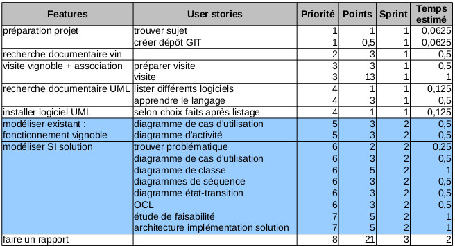

<h1 style="text-align:center;color:#2F5757">STRUCTURATION ET MODELISATION D’UN SYSTEME D’INFORMATION</h1>
<h1 style="text-align:center;color:#2F5757">Le vignoble de Suresnes</h1>

<h1 style="color: #2F5757">INTRODUCTION</h1>

Pour le projet de « Structuration et Modélisation d’un Système d’Information » réalisé du 23 Novembre 2015 au 14 Janvier 2015, nous avons fait le choix de prendre pour thématique la viticulture. En effet, notre étude porte sur le vignoble de Suresnes, dans les Hauts-de Seine.
L’intérêt du projet fut d’appliquer nos connaissances en modélisation et en gestion de projet, afin de proposer une solution adéquate aux éventuels besoins et souhaits des représentants de la vigne.

Ces derniers n’ayant aucun applicatif à ce jour pour la gestion des pieds de vigne, du stock ou encore de la vente des bouteilles de vin, nous avons orienté notre travail en répondant à la problématique suivante : quel système d’information est le plus adéquat à un vignoble de petite taille, qui n’utilise à ce jour, pas l’informatique ?

Ainsi, notre étude présentera un état des lieux du vignoble, avec ces différentes caractéristiques et ses principaux acteurs. Par la suite, nous détaillerons la solution proposée dans le cadre de ce projet en utilisant UML.
Enfin, nous verrons quelles sont les limites recensées tout au long de notre travail, ainsi que les perspectives et améliorations possibles de notre applicatif.

<h2 style="color:#FF6347">I. Analyse de l'existant</h2>

###a. Présentation du vignoble

La vigne de Suresnes est le plus grand vignoble d’Île de France, où 4500 pieds sont répartis sur 1 hectare. Il s’agit du seul vin ouvert à la vente, avec environ 5000 bouteilles produites par an. Pour en comprendre les caractéristiques, il est important d’en comprendre l’histoire.

<h4 style="text-decoration:underline;text-align:center">Histoire de la vigne de Suresnes</h4>

Dès le IXème siècle, la vigne est présente en Île-de-France sur les collines et les plateaux et notamment à Suresnes sur le Mont-Valérien. Pendant plusieurs siècles, le vin de Suresnes est réputé et plébiscité par les Rois de France, dont François 1er et Henri IV. On dénombre au XVIIème 64 vignerons sur une vingtaine d’hectares, ainsi que 30 bourgeois qui se partageaient 40 hectares de vignes. 
Le rude hiver de 1709 détruit de nombreux cépages, puis la construction de la ligne Paris-Versailles en 1839 finit d’altérer le vignoble. Ce dernier est aussi fortement affaibli par les parasites tels que le mildiou et l’oïdium. Ces différents facteurs de diminution de la vigne expliquent donc qu’en 1950, le vin de Suresnes ne soit produit que par un seul vigneron dénommé Robert Joyeux.
Pourtant en 1926, le Maire de Suresnes créé une vigne municipale, « Le Pas Saint-Maurice » sur les lieux d’une ancienne carrière. Cette vigne municipale fut abandonnée peu après suite à un manque d’entretien. 

Le Pas Saint-Maurice renaît suite à un ré-encépagement en cépages blancs sur 70 ares en 1965. Dès lors, la municipalité entreprend d’importants travaux, notamment la construction d’une cave moderne à l’endroit même de la vigne. 

Aujourd’hui, un vigneron professionnel s’occupe spécifiquement de la culture de la vigne et de l’élaboration du vin, sous le contrôle d’un laboratoire œnologique. L’association Le Clos du Pas Saint-Maurice a été conventionnée par la Mairie de Suresnes pour s’occuper de l’entretien de la vigne, de l’élaboration et de la commercialisation du vin. Une administratrice est quant à elle chargée de la gestion des ressources, c’est-à-dire de l’association, de sa comptabilité et du stock de bouteilles. Chaque année, la récolte oscille entre 35 et 60 hectolitres, permettant de produire jusqu’à 5000 bouteilles.

<h4 style="text-decoration:underline;text-align:center">Diagramme de cas d'utilisations de l'existant</h4>

Grâce à ces informations, nous avons réalisé un diagramme des cas d’utilisations. Il permet de mettre en évidence les différents acteurs et les principales actions réalisées au sein du vignoble.

###b. La vinification
###c. Réflexions sur les besoins du vignoble
###d. Le fonctionnement de l'équipe de projet
<h4 style="text-decoration:underline;text-align:center">La gestion de projet</h4>

L'équipe a essayé de gérer le projet en respectant la méthode Agile **SCRUM**.

En début de projet, elle a réfléchi au sujet et a listé les fonctionnalités qu'elle souhaitait développer en plusieurs grandes features.
Puis, elle a détaillé chacune d'entre elles en user stories, a attribué à chaque user story une priorité et un nombre de points selon la suite de Fibonacci, pour finalement en faire un backlog de référence.
Ce backlog contenait 81,5 points. Le projet s'étendant au départ sur 10 jours en salle projet, 3 sprints ont été définis pour que ce dernier soit achevé plus ou moins à la fin de ces 10 jours. Voici le détail de la backlog de référence.

L'équipe discutait quotidiennement du projet sans pour autant mener un réel daily stand up. Aucun Product Owner n'a été désigné ce qui a rendu la gestion de projet quelque peu difficile parfois. Cependant, l'équipe s'est appliquée, sur les 10 jours consacrés au projet en salle, à suivre le contenu de chaque sprint et à écrire la rétrospective de la journée dans un tableur au regard de ce contenu.

A la fin des 10 jours en salle projet, le projet était loin d'être terminé. Les membres de l'équipe ont continué à travailler dessus après les cours et chacun chez soi. À partir de ce moment, la gestion de projet est devenue plus compliquée et n'a plus été aussi bien suivie. Le retard était trop grand par rapport au temps destiné à chaque feature. Cependant, la communication entre les membres de l'équipe est restée permanente. Toutes les décisions ont été prises en groupe et validées par chacun, même si cela pouvait susciter un débat animé. Quand il y avait désaccord ou mécompréhension, ce qui arrivait régulièrement du fait des grandes possibilités d'orientation de la solution, le temps nécessaire était pris pour que l'équipe tombe finalement d'accord sur le chemin à suivre.
La réalisation des diagrammes a été de même réfléchie en groupe dans un premier temps, par l'écriture d'un scénario décidé en équipe dans le cas, par exemple, des diagrammes de séquence.

<h4 style="text-decoration:underline;text-align:center">La recherche documentaire</h4>

Pour réaliser son projet en UML, l'équipe s'est largement appuyée sur le cours de **Pierre Gérard**, professeur à l'université de Paris 13 - Villetaneuse : *Introduction à UML2, Modélisation Orientée Objet et de Systèmes Logiciels* (<http://www-lipn.univ-paris13.fr/~gerard/docs/cours/uml-cours-slides.pdf>).
De même, elle a puisé sur l'internet bon nombre de ressources pour s'aider dans l'utilisation correcte des **standards d'UML2**. Voici une liste non exhaustive d'exemples de liens :
- <http://www.uml.free.fr>
- les tutoriels recommandés sur le site <http://www.uml.org>
Puis, pour compléter la visite du vignoble de Suresnes et mieux comprendre le principe de vinification, le site très complet de l'Institut Français de la Vigne et du Vin (<http://www.vignevin.com>) a été consulté parmi d'autres, ainsi qu'évidemment le site de l'Office de Tourisme de Suresnes (<http://www.suresnes-tourisme.com/patrimoine-vitivinicole.html>). Des exemples de logiciels viti-vinicole commercialisés ont été trouvé pour voir ce qu'il se faisait déjà dans ce domaine : il est à noter Lavilog (<http://www.lavilog.com>).

<h4 style="text-decoration:underline;text-align:center">L'environnement de travail</h4>

L'équipe a réalisé les diagrammes avec les logiciels **ArgoUML** et **StarUML**.
Elle a créé un dépôt sur Github pour centraliser les données du projets et échanger.

=> ***<https://github.com/nisdrissi/Modelisation>***

La gestion de projet a été faite sur un tableur LibreOffice.
Le rapport a été rédigé en **markdown**, puis via **Pandoc**, a été convertit en 
LaTeX et depuis **LaTeX**, en PDF grâce à **Texmaker**.

<h2 style="color:#FF6347">II. Solution proposée</h2>

###b. Mieux connaître le vignoble

Le vigneron a la possibilité d’analyser son vignoble, d’avoir des statistiques précises pour chacun des pieds qui compose son domaine. Ainsi, la solution propose d’entrée des critères comme par exemple la cuvée, la parcelle ou encore l’année de plantation du pied. 
Tous ces critères lui permettent de croiser les informations pour avoir une visibilité plus fine des difficultés ou des points forts de sa vigne.

L’application détermine, selon les critères sélectionnés, quel est la représentation graphique la plus pertinente pour l’affichage des résultats. Le vigneron a ensuite une option d’export des résultats en fichier PDF.

###c. Un SI a destination des internautes

<h4 style="text-decoration:underline;text-align:center">Commander une bouteille 
de vin</h4>

L'internaute visite la page "Production du vin" du site qui le renseigne sur le processus de vinification une fois les vendanges faites.
Il souhaite ensuite acheter du vin.

Pour cela, il réalise plusieurs étapes :
- il lit le texte qui lui explique comment commander une bouteille de vin
- il choisit son mode d'achat :
  - sur place au vignoble
  - sur les sites revendeurs (Twil, Comptoir Des Vignes, La Ruche qui dit Oui)
- s'il choisit le mode d'achat sur place, il suit les étapes indiquées dans le scénario qui va suivre et qui est l'objet du diagramme de séquence **Commander une bouteille de vin**
- s'il choisit le mode d'achat en livraison par des revendeurs, il reçoit une liste des liens des sites à consulter.

Dans ce diagramme de séquence nous nous intéressons donc au cas d'utilisation d'achat sur place.
- l'internaute fait le choix sur le site de commander des bouteilles directement à retirer et payer au vignoble 
- le SI lui renvoie la liste des bouteilles en stock et disponibles à la vente aux particuliers
- l'internaute fait son choix de bouteilles et pour valider la commande, il doit s'authentifier par connexion ou inscription.
- une fois authentifié, il devient utilisateur du site et doit reconfirmer son choix de bouteilles. C'est alors que le SI vérifie si cet utilisateur est fiable ou non, c'est-à-dire s'il a déjà effectué des commandes auparavant qu'il est bien venu retirer ensuite au vignoble. S'il n'est pas fiable, la commande ne peut se faire, s'il l'est la commande est validée et enregistrée dans le SI.
- l'administrateur est informée de cette commande. L'utilisateur reçoit quant à lui un message de confirmation avec les dates où il peut venir retirer et payer sa bouteille au vignoble.

Suite à cela, l'utilisateur vient retirer sa bouteille tel que décrit dans le diagramme de séquence de **retrait de la bouteille**:
- s'il est bien venu retirer sa bouteille dans les dates imparties, l'administrateur en informe le SI qui met à jour définitivement le stock.
- s'il n'est pas venu dans les temps et que la bouteille est en attente, l'administrateur en informe le SI qui gère la relance par mail. Au bout de 3 relances, si l'utilisateur n'est toujours pas venu retirer et payer sa bouteille, la commande est définitivement annulée, l'utilisateur en est informé et le SI met à jour le niveau de confiance de l'utilisateur.

<h4 style="text-decoration:underline;text-align:center">Manipuler la cartographie du vignoble</h4>

L'internaute arrivant sur le site internet est directement dirigé vers la page d'accueil qui affiche une carte du vignoble. Cette carte est faite à partir de Leaflet et contient plusieurs couches:
- les coordonnées x et y des pieds de vignes
- les parcelles dont le vignoble est composé
- le vignoble.
Chaque couche correspond à une classe qui contient des attributs et des méthodes qui lui sont propres. Les outils classiques de manipulation de la carte sont disponibles à n'importe quel utilisateur non identifié : nous parlons ici des fonctionnalités de zoom/dézoom, navigation, et sélection. Ce sont des fonctionnalités intégrées à Leaflet. Lorsqu'un objet est sélectionné par un internaute non identifié, il est simplement mis en évidence sur la carte. L'internaute doit s'identifier pour avoir accès aux informations relatives à l'objet et devenir un utilisateur du site. Lorsqu'un objet est sélectionné par un utilisateur identifié, une fenêtre pop-up 
apparait à l'écran affichant les informations de l'objet.

Le diagramme de séquence ci-dessous représente le cas d'utilisation
**Visualiser les caractéristiques du pied**.
Un utilisateur non identifié vient consulter le site et sélectionne un pied de vigne sur la carte. Il se trouve confronté à l'impossibilité de consulter les informations du pied de vigne sélectionné puisqu'il ne s'est pas identifié.

###d. Une meilleure gestion administrative

La solution proposée permettra également à l’administrateur de gérer le stock de bouteilles de vin plus facilement. Il y a aussi la possibilité d’avoir une liste à jour des utilisateurs de la solution.

<h4 style="text-decoration:underline;text-align:center">La gestion du stock</h4>

En effet, le système d’information propose à l’administrateur de gérer de manière plus précise le stock destiné aux commandes effectuées sur l’application web. L’application tient compte des ventes réalisées les années précédentes pour déterminer quel est le meilleur nombre de bouteilles de vin à dédier au site, comme le montre le diagramme de séquence suivant.

L’administrateur peut ainsi consulter le stock actuel, l’analyser ou le modifier.Dans ce scenario, le vigneron décide d’analyser son stock, afin de savoir où il se situe par rapport aux stocks des années antérieures. Il obtient un pourcentage du nombre de bouteilles vendues. Suite à cela, l’applicatif lui fait une proposition en regard du stock actuel.
Si le nombre de bouteilles vendues est inférieur à 80 %, l’API propose de diminuer le stock.
Si le nombre de bouteilles vendues est entre 80 et 95%, l’API l’informe que le stock est bon.
Si le nombre de bouteilles vendues est supérieur ou égal à 95%, l’API propose d’augmenter le stock.

À noter, que le stock en question est celui dédié aux commandes réalisées sur l’application, et non le stock général qui comprend les bouteilles vendues dans la cave ou lors des différentes manifestations extérieures (foire, festival, etc).

<h4 style="text-decoration:underline;text-align:center">Authentification et inscription</h4>

La solution informatique permet également à des internautes de s’inscrire sur le site pour avoir accès à certaines fonctionnalités, notamment la commande de bouteille(s) de vin et la manipulation de la cartographie des pieds de vigne.

Une fois inscrit, l’administrateur doit valider la création du compte, en vérifiant que les champs saisis sont corrects, notamment le nom, prénom, adresse et numéro de téléphone. Cette vérification avant la validation finale du compte utilisateur permettra d’éviter les « fausses » commandes ou les compte « doubles ». Également, cela permettra une modération pour les personnes n’ayant jamais retirer 
leur commande, évitant donc qu’elles puissent se réinscrire à nouveau.

<h2 style="color:#FF6347">III. Limites et perspectives</h2>

###a. Limites et contraintes d’utilisation

Le système d’information proposé répond à certaines contraintes dans la gestion globale du vignoble et apporte des fonctionnalités inexistantes auparavant. Néanmoins, il instaure également des limites, principalement dues à la presque non-utilisation de l’informatique par les acteurs de la vigne. 

<h4 style="text-decoration:underline;text-align:center">Le passage à l'informatique</h4>

Dans un premier temps, le passage à l’informatique risque d’être complexe. En effet, cela demande du temps pour la formation, pour la numérisation des données et pour que les personnes s’habituent à utiliser la solution au quotidien. 

Cela risque ainsi de bouleverser le rythme actuellement en place et pourra, au début, sembler être une perte de productivité plus 
qu’autre chose. Ainsi, l’applicatif risque de demander des efforts importants dans la phase d’installation pour le vigneron et l’administrateur, et sera pleinement utilisé à moyen terme.

<h4 style="text-decoration:underline;text-align:center">La multiplicité des rôles</h4>

Également, comme le montre le diagramme des cas d’utilisation de l’existant (figure x) et de la solution (figure y), certains acteurs portent plusieurs rôles simultanément. Le vigneron pourra avoir accès à l’intégralité de l’applicatif, dont la gestion de stock ou la gestion des commandes par exemple, tout comme l’administrateur. Cela nécessitera une coordination au préalable de ces 2 acteurs pour éviter des modifications qui pourront être lourdes de conséquence comme par exemple le stock ou le contrôle des inscriptions. Ce chevauchement pourrait éventuellement être résolu par une restriction des accès au vigneron, notamment en ce qui concerne la gestion de l’application. 

<h4 style="text-decoration:underline;text-align:center">Limite d’un use-case : la gestion des commandes</h4>

Enfin, la solution porte également certaines limites, dont l’une qui concerne la gestion des commandes. Comme le montre le diagramme de séquence (fig. Z), l’utilisateur a la possibilité de commander des bouteilles de vin, selon ce qui est proposé par le site internet. Dès lors que la commande est validée et son statut de confiance correct, un e-mail lui est envoyé pour lui faire par des horaires auxquels il peut venir récupérer ses produits à la cave. La vente est donc « à emporter » avec un paiement sur place, limitant le nombre de clients potentiels à Suresnes et les communes voisines, au mieux, à l’Île-de-France.

Ce choix de ne pas proposer un paiement en ligne avec une livraison par la Poste découle du constat réalisé sur place à la cave. En effet, le vigneron étant seul et présent uniquement deux jours par semaine, la préparation des colis risque de lui prendre du temps et donc de réduire celui consacré au soin de la vigne et à la vinification.

###b. Perspectives et améliorations du SI

Au-delà de ces limites, certaines perspectives sont envisageables à court, moyen ou long terme pour rendre le système d’information plus pour la vigne de Suresnes.

<h4 style="text-decoration:underline;text-align:center">Drones (voir avec Zak)</h4>

<h4 style="text-decoration:underline;text-align:center">Un support important de communication</h4>

La solution étant une application de type web, elle constitue un support de communication fort et accessible à tous. Au fur et à mesure, l’administrateur pourra, s’il le souhaite, souhaiter l’ajout des manifestations culturelles auxquels l’association 
Le Clos du Pas Saint-Maurice participe sous la forme de publications dans une page « Actualités ». 

D’autre part, la vigne de Suresnes pourra décider de la mise en place d’un paiement en ligne et d’une livraison à domicile des bouteilles de vin, augmentant ainsi ses ventes. 

Ces différents aspects pourront permettre une amélioration de la reconnaissance du vignoble comme étant un lieu vivant de la ville de Suresnes, représentant ainsi son dynamisme et son attachement au patrimoine. 

<h1 style="color:#2F5757">CONCLUSION</h1>

En somme, le projet « Structuration et Modélisation d’un Système d’Information » a permis la mise en place d’un modèle pour l’implémentation d’un SI répondant à des critères spécifiques liés à la viticulture.

Il aura pour principales ambitions une meilleure gestion des pieds de vigne, avec des analyses de données très fines permettant au vigneron une gestion des risques plus efficace. C’est aussi un outil de gestion administrative avec un recensement automatique des utilisateurs inscrits et la possibilité de gérer le stock de bouteille de manière plus efficiente.

Enfin, cette solution est un outil de communication pour la Mairie de Suresnes et constitue une façade interactive et innovante pour le patrimoine viticole de la commune.
