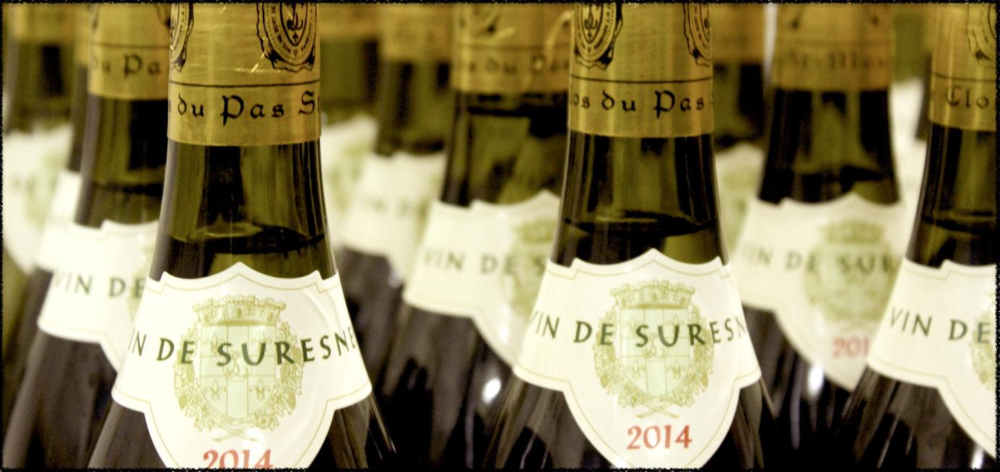
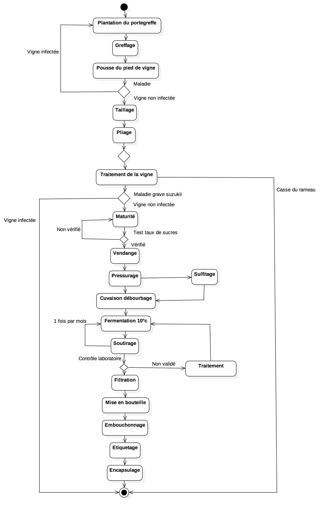

---
author:
- 'Zakaria Ait-Omar, Clémentine Chasles, Nisrine Drissi'
date: 14 janvier 2016
title: |
    STRUCTURATION ET MODÉLISATION D’UN SYSTÈME D’INFORMATION : Le vignoble
    de Suresnes
...

 \
Rapport de projet de
structuration et modélisation d’un SI\
\
 **STRUCTURATION ET MODÉLISATION D’UN SYSTÈME D’INFORMATION :Le
vignoble de Suresnes\
**

\
\

0.4

Zakaria Ait-Omar\
Zakaria Chasles\
Zakaria Drissi\
Master 2 TSI 2015-2016\

0.4

*Responsable :* M. Emmanuel Bardière\

14 janvier 2016

INTRODUCTION
============

Pour le projet de « Structuration et Modélisation d’un Système
d’Information » réalisé du 23 Novembre 2015 au 14 Janvier 2015, nous
avons fait le choix de prendre pour thématique la viticulture. En effet,
notre étude porte sur le vignoble de Suresnes, dans les Hauts-de Seine.
L’intérêt du projet fut d’appliquer nos connaissances en modélisation et
en gestion de projet, afin de proposer une solution adéquate aux
éventuels besoins et souhaits des représentants de la vigne.

Ces derniers n’ayant aucun applicatif à ce jour pour la gestion des
pieds de vigne, du stock ou encore de la vente des bouteilles de vin,
nous avons orienté notre travail en répondant à la problématique
suivante : **quel système d’information est le plus adéquat à un
vignoble de petite taille, qui n’utilise à ce jour, pas
l’informatique ?**

Ainsi, notre étude présentera un état des lieux du vignoble, avec ces
différentes caractéristiques et ses principaux acteurs. Par la suite,
nous détaillerons la solution proposée dans le cadre de ce projet en
utilisant UML. Enfin, nous verrons quelles sont les limites recensées
tout au long de notre travail, ainsi que les perspectives et
améliorations possibles de notre applicatif.

Analyse de l’existant
=====================

Présentation du vignoble
------------------------

La vigne de Suresnes est le plus grand vignoble d’Île de France, où 4500
pieds sont répartis sur 1 hectare. Il s’agit du seul vin ouvert à la
vente, avec environ 5000 bouteilles produites par an. Pour en comprendre
les caractéristiques, il est important d’en comprendre l’histoire.

### Histoire de la vigne de Suresnes

Dès le IXème siècle, la vigne est présente en Île-de-France sur les
collines et les plateaux et notamment à Suresnes sur le Mont-Valérien.
Pendant plusieurs siècles, le vin de Suresnes est réputé et plébiscité
par les Rois de France, dont François 1er et Henri IV. On dénombre au
XVIIème 64 vignerons sur une vingtaine d’hectares, ainsi que 30
bourgeois qui se partagent 40 hectares de vignes. Le rude hiver de 1709
détruit de nombreux cépages, puis la construction de la ligne
Paris-Versailles en 1839 finit d’altérer le vignoble. Ce dernier est
aussi fortement affaibli par les parasites tels que le mildiou et
l’oïdium. Ces différents facteurs de diminution de la vigne expliquent
donc qu’en 1950, le vin de Suresnes ne soit produit que par un seul
vigneron dénommé Robert Joyeux. Pourtant en 1926, le Maire de Suresnes
créé une vigne municipale, « Le Pas Saint-Maurice » sur les lieux d’une
ancienne carrière. Cette vigne municipale fut abandonnée peu après suite
à un manque d’entretien.

Le Pas Saint-Maurice renaît suite à un ré-encépagement en cépages blancs
sur 70 ares en 1965. Dès lors, la municipalité entreprend d’importants
travaux, notamment la construction d’une cave moderne à l’endroit même
de la vigne.

Aujourd’hui, un vigneron professionnel s’occupe spécifiquement de la
culture de la vigne et de l’élaboration du vin, sous le contrôle d’un
laboratoire œnologique. L’association Le Clos du Pas Saint-Maurice a été
conventionnée par la Mairie de Suresnes pour s’occuper de l’entretien de
la vigne, de l’élaboration et de la commercialisation du vin. Une
administratrice est quant à elle chargée de la gestion des ressources,
c’est-à-dire de l’association, de sa comptabilité et du stock de
bouteilles. Chaque année, la récolte oscille entre 35 et 60 hectolitres.

Grâce à ces informations, nous avons réalisé un diagramme des cas
d’utilisations. Il permet de mettre en évidence les différents acteurs
et les principales actions réalisées au sein du vignoble.

### Diagramme de cas d’utilisations de l’existant

La vinification
---------------

Le vigneron de l’association Le Clos du Pas Saint-Maurice effectue
plusieurs tâches et suit un processus bien précis pour produire le vin
blanc du Suresnes. Dans ce chapitre nous décrivons toutes les étapes
essentielles avec tous les indicateurs nécessaires. Le diagramme
d’activité a été choisi pour synthétiser la démarche de vinification,
car il permet de représenter les processus interactifs. Ce diagramme
ci-dessous présente les grandes activités exercées dans le vignoble et
qui sont effectuées par le vigneron et en incluant les différents
tests :

Le fonctionnement de l’équipe de projet {#le-fonctionnement-de-lequipe-de-projet}
---------------------------------------

### La gestion de projet

Notre équipe a essayé de gérer le projet en respectant la méthode Agile
**SCRUM**. En début de projet, nous avons réfléchi au sujet et listé les
fonctionnalités que nous souhaitions développer en plusieurs grandes
features. Puis, nous avons détaillé chacune d’entre elles en user
stories, avons attribué à chaque user story une priorité et un nombre de
points selon la suite de Fibonacci, pour finalement en faire un backlog
de référence. Ce backlog contenait 81,5 points. Le projet s’étendant au
départ sur 10 jours en salle projet, 3 sprints ont été définis pour que
ce dernier soit achevé plus ou moins à la fin de ces 10 jours. Voici le
détail de la backlog de référence.

### La recherche documentaire

Pour réaliser notre projet en UML, nous nous sommes largement appuyés
sur le cours de **Pierre Gérard**, professeur à l’université de Paris 13
- Villetaneuse : *Introduction à UML2, Modélisation Orientée Objet et de
Systèmes Logiciels*
(<http://www-lipn.univ-paris13.fr/~gerard/docs/cours/uml-cours-slides.pdf>).
De même, nous avons puisé sur l’internet bon nombre de ressources pour
nous aider dans l’utilisation correcte des **standards d’UML2**. Voici
une liste non exhaustive d’exemples de liens :

-   <http://www.uml.free.fr>

-   les tutoriels recommandés sur le site <http://www.uml.org> Puis,
    pour compléter la visite du vignoble de Suresnes et mieux comprendre
    le principe de vinification, le site très complet de l’Institut
    Français de la Vigne et du Vin (<http://www.vignevin.com>) nous a
    aidés, ainsi qu’évidemment le site de l’Office de Tourisme de
    Suresnes
    (<http://www.suresnes-tourisme.com/patrimoine-vitivinicole.html>).
    Nous avons aussi trouvé des exemples de logiciels viti-vinicole
    commercialisés pour voir ce qu’il se faisait déjà dans ce domaine :
    il est à noter Lavilog (<http://www.lavilog.com>).

### L’environnement de travail

Notre équipe a réalisé les diagrammes avec les logiciels **ArgoUML** et
**StarUML**. Nous avons créé un dépôt sur Github pour centraliser les
données du projets et échanger.

=&gt; ***<https://github.com/nisdrissi/Modelisation>***

La gestion de projet a été faite sur un tableur LibreOffice. Le rapport
a été rédigé en **markdown**, puis via **Pandoc**, a été convertit en
LaTeX et depuis **LaTeX**, en PDF grâce à **Texmaker**.

Solution proposée {#solution-proposee}
=================

Conception de la solution
-------------------------

La gestion de vignoble est depuis plusieurs années considérée comme un
domaine traditionnel géré par des gens qui ont de l’expérience dans la
vinification. Ainsi, l’enjeu prioritaire des gestionnaires de l’
association du Clos du Pas Saint-Maurice doit sans doute résider dans
l’adaptation d’un système d’information qui répond à un environnement en
continuelle évolution. Cependant, le déploiement d’une gestion de
vignoble dans l’ association doit être mûrement réfléchi. Il convient au
préalable de définir clairement les étapes et les objectifs de la
vinification et du vignoble. Ce processus a fait l’objet de la démarche
de gestion que nous avons proposée. D’autre part, les systèmes
d’information de gestion du vignoble qui secondent cette démarche
mettent à la disposition des vignerons et managers de l’ association de
véritables outils d’aide à la décision, et se veulent utiles à tous les
niveaux du processus de vinification et de vente du vin blanc. Notre
projet vient dans ce sens et se fixe ces mêmes objectifs adaptés à la
vision stratégique de l’ association. Dans notre système nous allons
identifier tous les pieds de vigne avec leurs positions dans le vignoble
à fin de garantir un suivi interactif sur une carte déployée sur notre
application.

### Grands choix techniques

Dans le but de conduire un projet réel et de produire une application
web de qualité qui répond aux besoins de l’ association dans des temps
et des coûts prévisibles, il est nécessaire de choisir une méthode de
développement et de déploiement. UML est un langage graphique qui permet
de représenter, de communiquer les divers aspects d’un système
d’information avec des textes associés aux graphiques explicitant leur
contenu. Il permet ainsi, de passer du modèle au système de manière
lisible et argumentée. Lisible, car pour faire évoluer le système, il
faut pouvoir faire le lien entre les objets du domaine et les objets du
système. Argumentée, car les choix techniques sont complexes,
indépendants et doivent être périodiquement révisés pour tenir compte de
l’évolution des environnements. Java Entreprise Edition, ou Java EE est
une spécification pour la technique Java de Sun plus particulièrement
destinée aux applications d’entreprise. L’implémentation de cette
spécification contient un ensemble d’extensions au framework Java
standard (JSE, Java Standard Edition) afin de faciliter la création
d’applications réparties. Le choix de cette technologie est justifié,
d’une part par la maturité et la richesse de cette dernière et d’autre
part, par la gratuité de la solution car il s’agit d’une technologie
Open Source.

### Besoins fonctionnels

Cette phase consiste à recueillir les différents besoins fonctionnels et
techniques qui seront traduits dans notre système par un ensemble de
fonctionnalités et de technologies. La première étape de cette phase a
pour objectif d’étaler les besoins exprimés par les dirigeants de l’
association sur un ensemble de fonctionnalités et cela a été bien fait
au travers de deux rendez-vous, alors que la deuxième étape consiste à
expliciter le besoin en termes de technologies et d’outils à utiliser
afin de répondre aux besoins fonctionnels en prenant en considération le
budget d’une telle association.

Notre projet consiste en la conception et le développement d’une
application Web pour la gestion de vignoble. Cependant, cette
application devra permettre de couvrir les volets suivant :

-   **Gestion du vignoble**: permet de gérer les données concernant
    l’ensemble des étapes de la vinification à fin de produire le
    vin blanc.

-   **Gestion de stock**: permet de renseigner pour l’association l’état
    du stock de leur production.

-   **Gestion des commandes** : permet de gérer toutes les commandes et
    ventes de vignoble.

-   **Gestion des profils** : permet de définir les rôles association
    des grands acteurs qui vont réagir avec notre système. Ces profils
    ainsi définis, représentent des profils types requis par chaque
    fonction dans l’association.

### Besoins techniques

L’architecture en couches est la conséquence inévitable d’une approche
qui s’appuie sur la réalisation de composants réutilisables. Dans le but
de réaliser un système évolutif et modulaire, l’architecture adoptée est
une architecture en couches qui garantit le maximum de découplage entre
les couches logicielles mises en œuvre. Elle a ainsi les propriétés
suivantes :

-   Une couche ne communique qu’avec ses deux couches
    voisines immédiates.

-   Une couche délègue à la couche inférieure le travail qu’elle ne
    prend pas en charge.

-   Une couche retourne à la couche supérieure son résultat.

Ainsi, une architecture n-tiers (architecture 4 tiers) a été adoptée.

### Base de données

Dans cette partie sera établi le modèle statique du système en
présentant des tables candidates avant de projeter la partie
fonctionnelle de l’application sur son architecture logicielle selon les
couches qu’elle présente, à savoir : la couche présentation, la couche
applicative, la couche objets métier et la couche accès aux données.

-   **Vignoble** : C’est la classe associative qui rassemble toutes les
    tables et qui référence notre vignoble à une année bien précise.

-   **Utilisateur**: Fait référence aux comptes de tous les profils qui
    vont utiliser notre application.

-   **Bouteille** : C’est la table qui décrit notre produit essentiel.

-   **Stock** : Il s’agit du nombre de bouteilles qui existe dans
    notre vignoble.

-   **Commande** : C’est une table associative dans laquelle on précise
    qui a fait la commande de quoi et à quelle date.

-   **Cuve** : Il s’agit d’une table dont laquelle on stock tous les
    éléments nécessaires à chaque étape de la vinification.

-   **Parcelle de vigne** : Fait référence à toutes les parcelles qui
    constituent le vignoble.

-   **Pied de vigne**: Désigne les caractéristiques de tous les pieds de
    vigne du vignoble dès la mise en place de l’application.

Le diagramme ci-après illustre les différentes tables en spécifiant les
interactions entres ces tables :

### Diagramme de classes

Le diagramme des classes de l’application représente les différentes
relations et liaisons entre les classes candidates du système appelées
aussi objets persistants. Le diagramme ci-dessous illustre les
différentes classes qui vont constituer notre système :

Mieux connaître le vignoble
---------------------------

Le vigneron a la possibilité d’analyser son vignoble, d’avoir des
statistiques précises pour chacun des pieds qui compose son domaine.
Ainsi, la solution propose d’entrée des critères comme par exemple la
cuvée, la parcelle ou encore l’année de plantation du pied. Tous ces
critères lui permettent de croiser les informations pour avoir une
visibilité plus fine des difficultés ou des points forts de sa vigne.
L’application détermine, selon les critères sélectionnés, quel est la
représentation graphique la plus pertinente pour l’affichage des
résultats. Le vigneron a ensuite une option d’export des résultats en
fichier PDF.

Un SI à destination des internautes
-----------------------------------

### Commander une bouteille de vin

L’internaute visite la page “Production du vin” du site qui le renseigne
sur le processus de vinification une fois les vendanges faites. Il
souhaite ensuite acheter du vin. Seul l’achat au vignoble est possible
notre solution de proposant pas la vente en ligne et la livraison.

Pour finaliser son achat une fois la bouteille commandée via
l’application, l’utilisateur vient retirer sa bouteille tel que décrit
dans le diagramme de séquence ci-dessous :

### Manipuler la cartographie du vignoble

L’internaute arrivant sur le site internet est directement dirigé vers
la page d’accueil qui affiche une carte du vignoble. Cette carte est
faite à partir de Leaflet et contient plusieurs couches (les coordonnées
x et y, les pieds de vignes, le vignoble). S’il n’est pas identifié et
qu’il sélectionne un pied de vigne sur la carte, il se trouve confronté
à l’impossibilité de consulter les informations du pied de vigne
sélectionné. Le diagramme de séquence suivant détaille cette situation.

Une meilleure gestion administrative
------------------------------------

La solution proposée permettra également à l’administrateur de gérer le
stock de bouteilles de vin plus facilement. Il y a aussi la possibilité
d’avoir une liste à jour des utilisateurs de la solution.

### La gestion du stock

En effet, le système d’information propose à l’administrateur de gérer
de manière plus précise le stock destiné aux commandes effectuées sur
l’application web. L’application tient compte des ventes réalisées les
années précédentes pour déterminer quel est le meilleur nombre de
bouteilles de vin à dédier au site, comme le montre le diagramme de
séquence suivant.

L’administrateur peut ainsi consulter le stock actuel, l’analyser ou le
modifier. Dans ce scénario, le vigneron décide d’analyser son stock,
afin de savoir où il se situe par rapport aux stocks des années
antérieures. Il obtient un pourcentage du nombre de bouteilles vendues.
Suite à cela, l’applicatif lui fait une proposition en regard du stock
actuel.

À noter, que le stock en question est celui dédié aux commandes
réalisées sur l’application, et non le stock général qui comprend les
bouteilles vendues dans la cave ou lors des différentes manifestations
extérieures (foires, festivals, etc).

### Authentification et inscription

La solution informatique permet également à des internautes de
s’inscrire sur le site pour avoir accès à certaines fonctionnalités,
notamment la commande de bouteille(s) de vin et la manipulation de la
cartographie des pieds de vigne.

Une fois inscrit, l’administrateur doit valider la création du compte,
en vérifiant que les champs saisis sont corrects, notamment le nom,
prénom, adresse et numéro de téléphone. Cette vérification avant la
validation finale du compte utilisateur permettra d’éviter les
« fausses » commandes ou les comptes « doubles ». Également, cela
permettra une modération pour les personnes n’ayant jamais retirer leur
commande, évitant donc qu’elles puissent commander à nouveau.

Architecture
------------

### Navigation des acteurs

#### L’utilisateur

L’acteur Utilisateur dispose de plusieurs fonctionnalités portant
notamment sur la consultation et le suivi des activités de
l’association. Afin d’avoir une vision concrète sur l’accès qu’il a vers
ces fonctionnalités, la figure ci-dessous a été réalisée :

#### L’administrateur

L’application offre à l’acteur Administrateur plusieurs fonctionnalités
se rapportant à la gestion du stock et à la gestion des profils ainsi
qu’à la gestion des différentes publications et activités de
l’association. L’enchaînement des pages offrant ces fonctionnalités est
bien illustré par le diagramme de navigation présenté sur la figure
suivante :

#### Le vigneron

Afin d’éviter l’encombrement du diagramme de navigation de l’acteur
Vigneron, et pour une meilleur lisibilité, un cadrant intitulé « Zoom »
n’a pas été détaillé sur ce même diagramme. La figure ci-après, fait un
zoom sur cette partie du diagramme de navigation qui concerne la gestion
du de vignoble :

### Architecture de la solution

L’architecture adoptée est une architecture en couches qui sépare
distinctement les quatre couches suivantes :

#### Couche présentation {#couche-presentation}

La couche présentation fait l’interface avec l’utilisateur. Sa première
tâche est d’afficher les données qu’elle a récupérées auprès de la
couche accès aux données. Sa seconde tâche est de recevoir toutes les
actions de l’utilisateur (clic de souris, sélection d’une entrée,
boutons, …). Ses différents événements sont envoyés à la couche
applicative.

#### Couche applicative {#couche applicative}

La couche applicative joue le rôle principal dans la synchronisation de
la couche présentation et la couche accès aux données. Elle reçoit tous
les événements de l’utilisateur et enclenche les actions à effectuer. Si
une action nécessite un changement de données, c’est cette couche qui
possède les outils pour demander la modification des données à la couche
accès aux données et ensuite avertir la couche présentation que les
données ont changé afin que celle-ci se mette à jour. Certains
événements de l’utilisateur ne concernent pas les données mais la couche
présentation elle-même. Dans ce cas, elle demande à la couche
présentation de se modifier.

#### Couche objets métier {#couche-objets-muxe9tier}

La couche objets métier est représentée par l’ensemble des entités
persistantes de l’application. Ces entités représentent les Entity Bean
pris en charge par EJB. Ils possèdent entre autre les propriétés
suivantes :

-   Ce sont des objets qui savent se mapper dans une base de données.

-   Ils utilisent un mécanisme de persistance.

-   Ils servent à représenter sous forme d’objets des données situées
    dans une base de données.

-   Le plus souvent un objet = une ou plusieurs ligne(s) dans une ou
    plusieurs table(s).

#### Couche accès aux données {#couche-acces-donnees}

La couche accès aux données assure la gestion des données de
l’application et garantit leur intégrité. Elle offre des méthodes pour
mettre à jour ces données (insertion, suppression, changement de
valeur).

Définitions :

-   **Les servlets** : Une servlet est un programme java déployé sur un
    serveur web chargé automatiquement dans le serveur ou à la demande
    d’un client. Une fois déployée, elle reste en attente des
    requêtes clients. Elle génère dynamiquement des données sous format
    de pages Web (format HTML ou XML)

-   **Les JSPs** : Ce sont des composants permettant de générer
    dynamiquement des pages web. Le modèle JSP est dérivé du
    modèle servlet. À l’appel d’un client, le serveur Web appelle le
    moteur JSP pour générer le code source, le compile pour générer
    l’exécutable de la servlet qui traite la requête.

-   **EJB Reçoit**: l’information de l’application la traite et met à
    jour les données stockées dans le “tier” gestion des ressources ; il
    récupère l’information stockée, la traite et renvoie le résultat de
    ses traitements au client.

Limites et perspectives
=======================

Limites et contraintes d’utilisation
------------------------------------

Le système d’information proposé répond à certaines contraintes dans la
gestion globale du vignoble et apporte des fonctionnalités inexistantes
auparavant. Néanmoins, il instaure également des limites, principalement
dues à la presque non-utilisation de l’informatique par les acteurs de
la vigne.

### Le passage à l’informatique

Dans un premier temps, le passage à l’informatique risque d’être
complexe. En effet, cela demande du temps pour la formation, pour la
numérisation des données et pour que les personnes s’habituent à
utiliser la solution au quotidien.

Cela risque ainsi de bouleverser le rythme actuellement en place et
pourra, au début, sembler être une perte de productivité plus qu’autre
chose. Ainsi, l’applicatif risque de demander des efforts importants
dans la phase d’installation pour le vigneron et l’administrateur, et
sera pleinement utilisé à moyen terme.

### La multiplicité des rôles

Également, comme le montre le diagramme des cas d’utilisation de
l’existant (figure x) et de la solution (figure y), certains acteurs
portent plusieurs rôles simultanément. Le vigneron pourra avoir accès à
l’intégralité de l’applicatif, dont la gestion de stock ou la gestion
des commandes par exemple, tout comme l’administrateur. Cela nécessitera
une coordination au préalable de ces deux acteurs pour éviter des
modifications qui pourront être lourdes de conséquence comme par exemple
sur le stock ou le contrôle des inscriptions. Ce chevauchement pourrait
éventuellement être résolu par une restriction des accès au vigneron,
notamment en ce qui concerne la gestion de l’application.

### Limite d’un use-case : la gestion des commandes

Enfin, la solution porte également certaines limites, dont l’une qui
concerne la gestion des commandes. Comme le montre le diagramme de
séquence (figure z), l’utilisateur a la possibilité de commander des
bouteilles de vin, selon ce qui est proposé par le site internet. Dès
lors que la commande est validée et son statut de confiance correct, un
e-mail lui est envoyé pour lui faire part des horaires auxquels il peut
venir récupérer ses produits à la cave. La vente est donc « à emporter »
avec un paiement sur place, limitant le nombre de clients potentiels à
Suresnes et les communes voisines, au mieux, à l’Île-de-France.

Ce choix de ne pas proposer un paiement en ligne avec une livraison par
la Poste découle du constat réalisé sur place à la cave. En effet, le
vigneron étant seul et présent uniquement deux jours par semaine, la
préparation des colis risque de lui prendre du temps et donc de réduire
celui consacré au soin de la vigne et à la vinification.

Perspectives et améliorations du SI
-----------------------------------

Au-delà de ces limites, certaines perspectives sont envisageables à
court, moyen ou long terme pour rendre le système d’information plus
pour la vigne de Suresnes.

### Drones

L’une des perspectives d’amélioration de l’outil proposé consiste à
utiliser des drones pour la prise d’images aériennes pouvant être
interprétées.

Elles pourront faire l’objet d’un traitement d’image pour calculer des
indicateurs comme par exemple le NDVI (Indice de Végétation par
Différence Normalisé). Cela constitue un ajout de métadonnées précises
pour chacun des pieds de vigne.

### Un support important de communication

La solution étant une application de type web, elle constitue un support
de communication fort et accessible à tous. Au fur et à mesure,
l’administrateur pourra, s’il le souhaite, ajouter des manifestations
culturelles auxquelles l’association Le Clos du Pas Saint-Maurice
participe, sous la forme de publications dans une page « Actualités ».

D’autre part, la vigne de Suresnes pourra décider de la mise en place
d’un paiement en ligne et d’une livraison à domicile des bouteilles de
vin, augmentant ainsi ses ventes.

Ces différents aspects pourront permettre une amélioration de la
reconnaissance du vignoble comme étant un lieu vivant de la ville de
Suresnes, représentant ainsi son dynamisme et son attachement au
patrimoine.

CONCLUSION
==========

En somme, le projet « Structuration et Modélisation d’un Système
d’Information » a permis la mise en place d’un modèle pour
l’implémentation d’un SI répondant à des critères spécifiques liés à la
viticulture.

Il aura pour principales ambitions une meilleure gestion des pieds de
vigne, avec des analyses de données très fines permettant au vigneron
une gestion des risques plus efficace. C’est aussi un outil de gestion
administrative avec un recensement automatique des utilisateurs inscrits
et la possibilité de gérer le stock de bouteilles de manière plus
efficiente.

Enfin, cette solution est un outil de communication pour la Mairie de
Suresnes et constitue une façade interactive et innovante pour le
patrimoine viticole de la commune.

