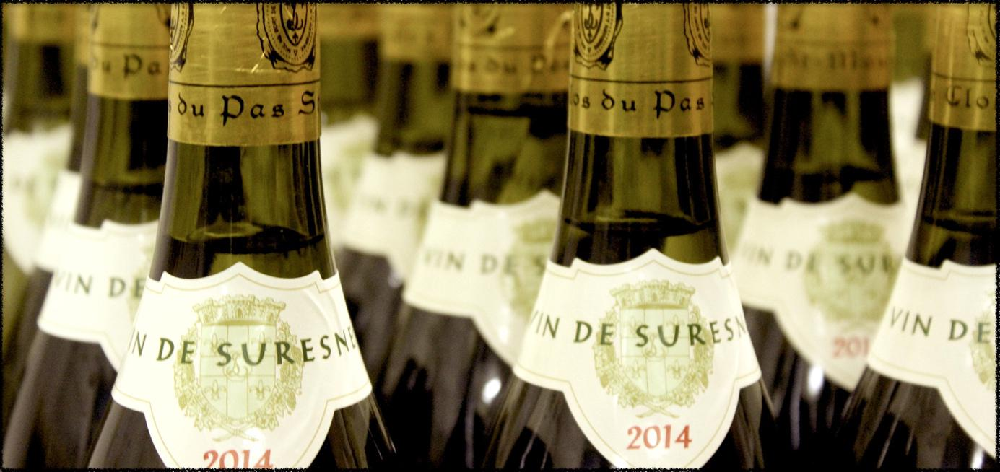
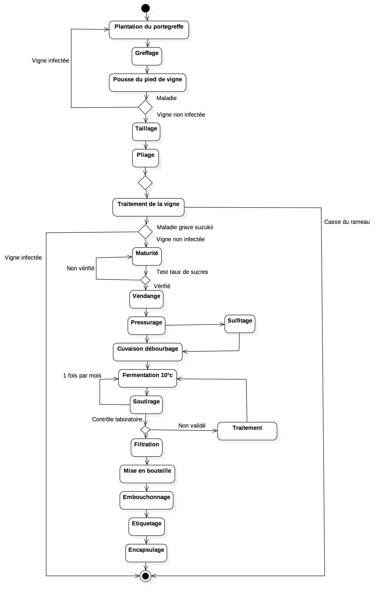
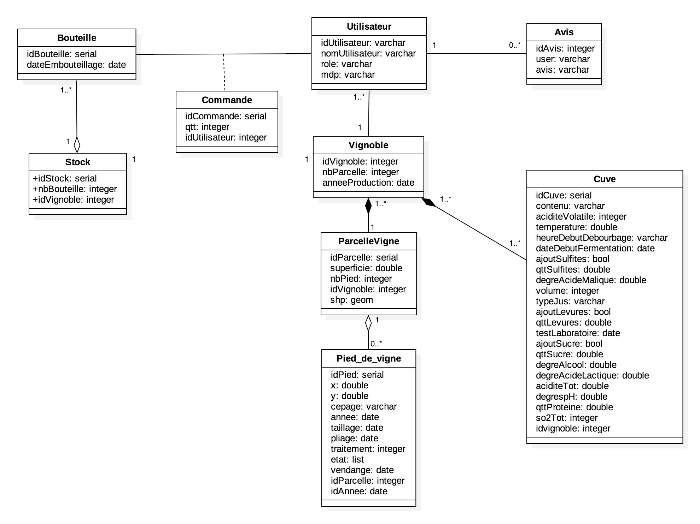
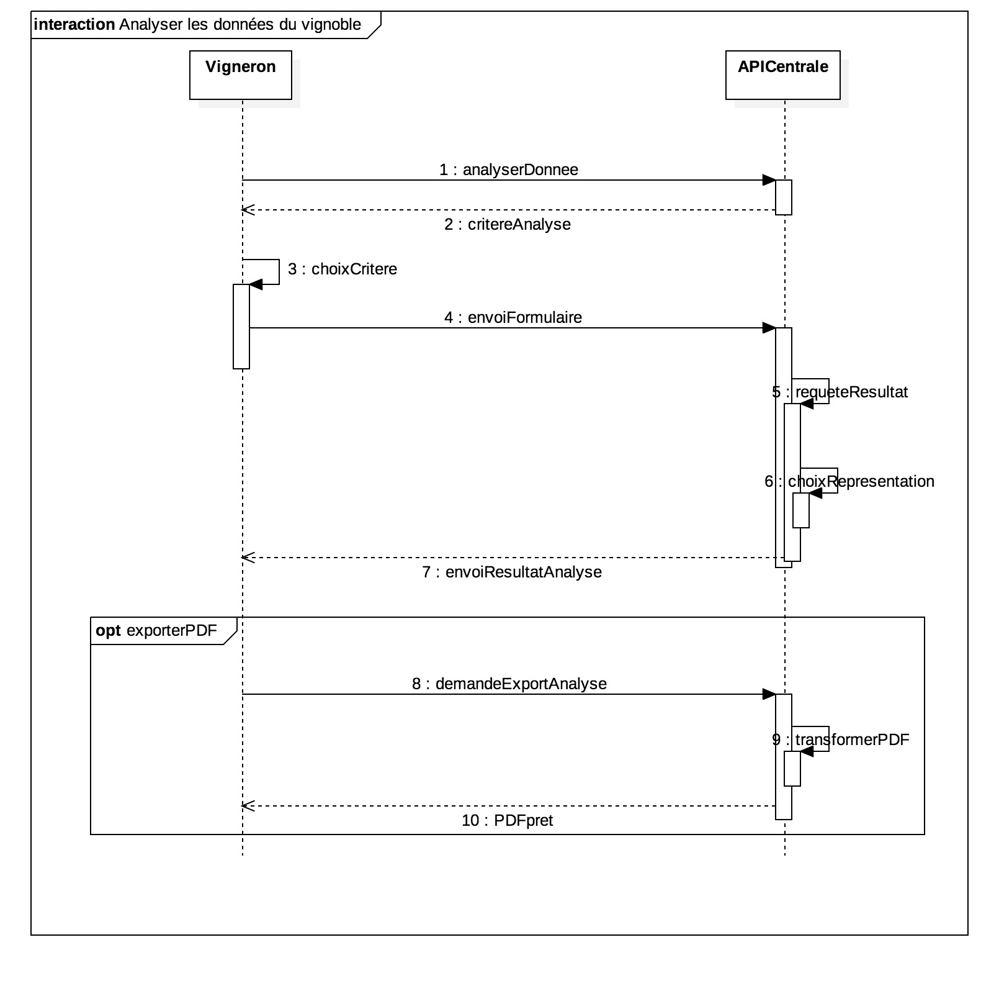
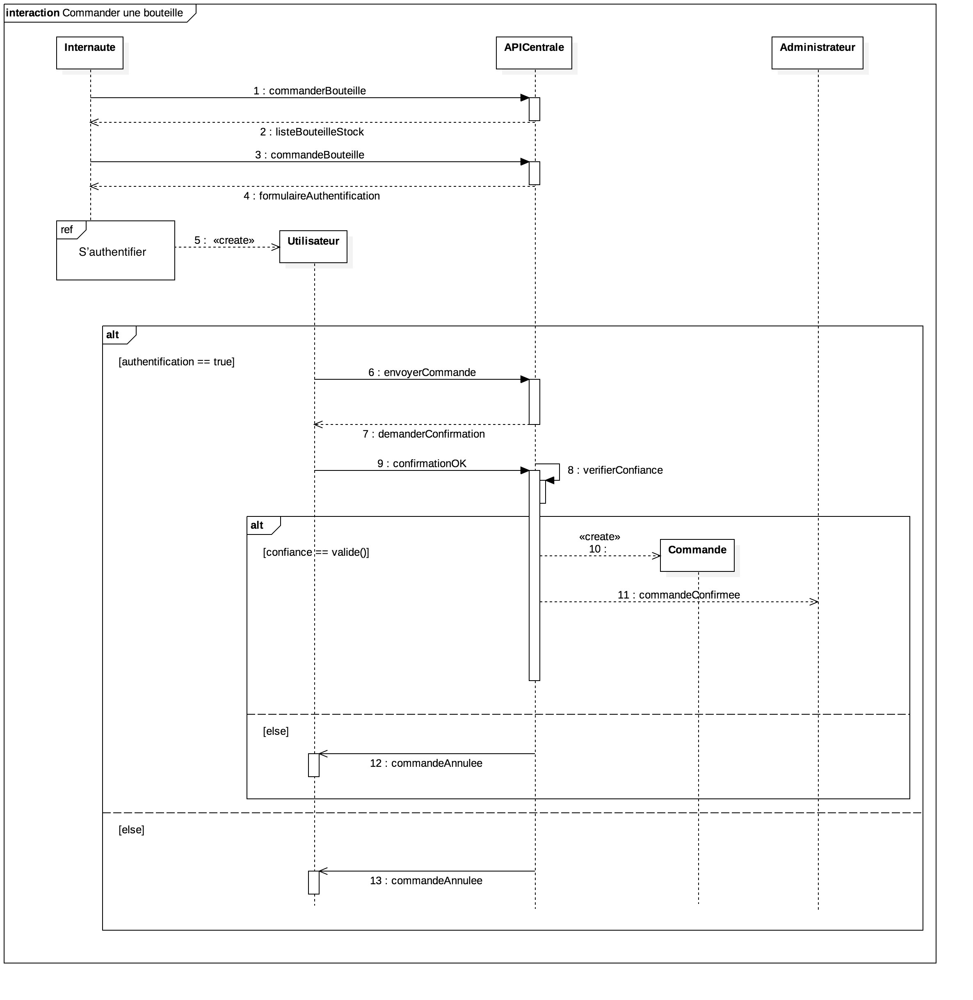
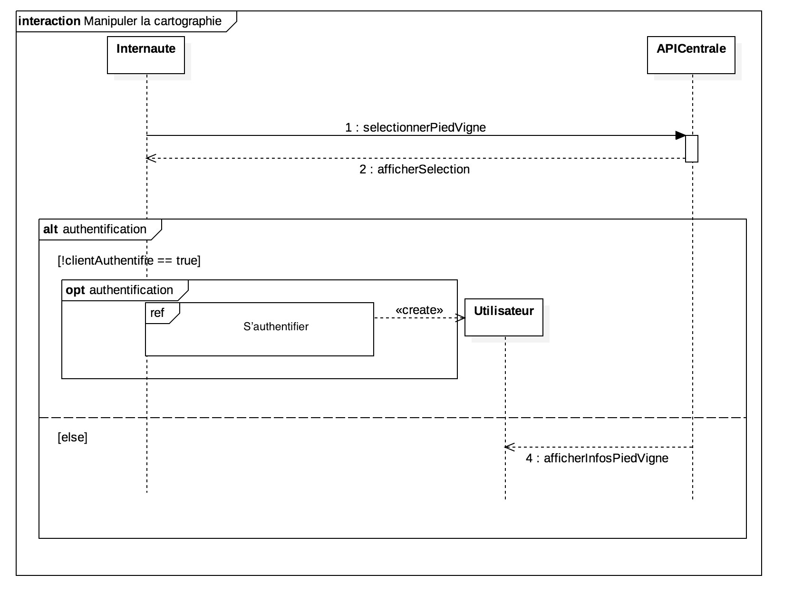
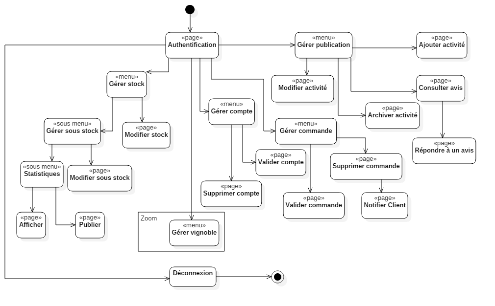
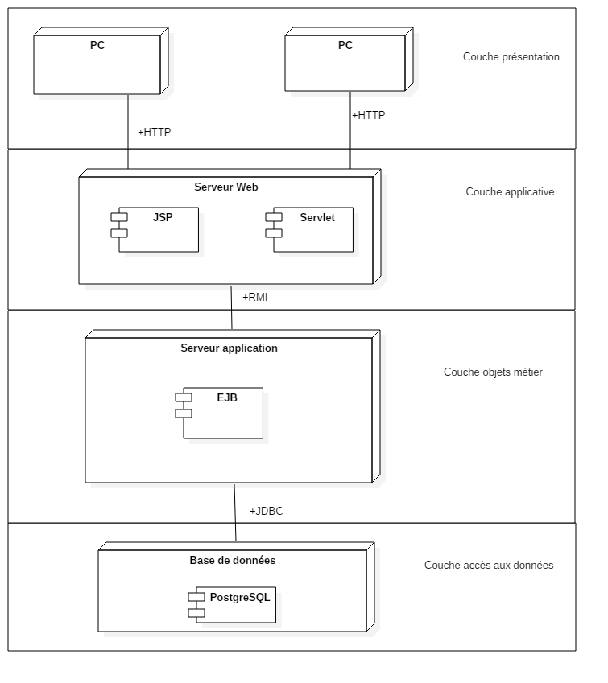

# STRUCTURATION ET MODELISATION D’UN SYSTEME D’INFORMATION : Le vignoble de Suresnes

## INTRODUCTION

Pour le projet de « Structuration et Modélisation d’un Système d’Information » réalisé du 23 Novembre 2015 au 14 Janvier 2015, nous avons fait le choix de prendre pour thématique la viticulture. En effet, notre étude porte sur le vignoble de Suresnes, dans les Hauts-de Seine.
L’intérêt du projet fut d’appliquer nos connaissances en modélisation et en gestion de projet, afin de proposer une solution adéquate aux éventuels besoins et souhaits des représentants de la vigne.

Ces derniers n’ayant aucun applicatif à ce jour pour la gestion des pieds de vigne, du stock ou encore de la vente des bouteilles de vin, nous avons orienté notre travail en répondant à la problématique suivante :
**quel système d’information est le plus adéquat à un vignoble de petite taille, qui n’utilise à ce jour, pas l’informatique ?**

Ainsi, notre étude présentera un état des lieux du vignoble, avec ces différentes caractéristiques et ses principaux acteurs.
Par la suite, nous détaillerons la solution proposée dans le cadre de ce projet en utilisant UML.
Enfin, nous verrons quelles sont les limites recensées tout au long de notre travail, ainsi que les perspectives et améliorations possibles de notre applicatif.

### 1 Analyse de l'existant
#### 1.1 Présentation du vignoble

La vigne de Suresnes est le plus grand vignoble d’Île de France, où 4500 pieds sont répartis sur 1 hectare. Il s’agit du seul vin ouvert à la vente, avec environ 5000 bouteilles produites par an. Pour en comprendre les caractéristiques, il est important d’en comprendre l’histoire.

##### 1.1.1 Histoire de la vigne de Suresnes

Dès le IXème siècle, la vigne est présente en Île-de-France sur les collines et les plateaux et notamment à Suresnes sur le Mont-Valérien. Pendant plusieurs siècles, le vin de Suresnes est réputé et plébiscité par les Rois de France, dont François 1er et Henri IV. On dénombre au XVIIème 64 vignerons sur une vingtaine d’hectares, ainsi que 30 bourgeois qui se partagent 40 hectares de vignes. 
Le rude hiver de 1709 détruit de nombreux cépages, puis la construction de la ligne Paris-Versailles en 1839 finit d’altérer le vignoble. Ce dernier est aussi fortement affaibli par les parasites tels que le mildiou et l’oïdium. Ces différents facteurs de diminution de la vigne expliquent donc qu’en 1950, le vin de Suresnes ne soit produit que par un seul vigneron dénommé Robert Joyeux.
Pourtant en 1926, le Maire de Suresnes créé une vigne municipale, « Le Pas Saint-Maurice » sur les lieux d’une ancienne carrière. Cette vigne municipale fut abandonnée peu après suite à un manque d’entretien.

Le Pas Saint-Maurice renaît suite à un ré-encépagement en cépages blancs sur 70 ares en 1965. Dès lors, la municipalité entreprend d’importants travaux, notamment la construction d’une cave moderne à l’endroit même de la vigne.

Aujourd’hui, un vigneron professionnel s’occupe spécifiquement de la culture de la vigne et de l’élaboration du vin, sous le contrôle d’un laboratoire œnologique. L’association Le Clos du Pas Saint-Maurice a été conventionnée par la Mairie de Suresnes pour s’occuper de l’entretien de la vigne, de l’élaboration et de la commercialisation du vin. Une administratrice est quant à elle chargée de la gestion des ressources, c’est-à-dire de l’association, de sa comptabilité et du stock de bouteilles. Chaque année, la récolte oscille entre 35 et 60 hectolitres.

##### 1.1.2 Diagramme de cas d'utilisations de l'existant

Grâce à ces informations, nous avons réalisé un diagramme des cas d’utilisations. Il permet de mettre en évidence les différents acteurs et les principales actions réalisées au sein du vignoble.

#### 1.2 La vinification

Le vigneron de l’association Le Clos du Pas Saint-Maurice effectue plusieurs tâches et suit un processus bien précis pour produire le vin blanc du Suresnes. Dans ce chapitre nous décrivons toutes les étapes essentielles avec tous les indicateurs nécessaires.
Le diagramme d’activité a été choisi pour synthétiser la démarche de vinification, car il permet de représenter les processus interactifs. Ce diagramme ci-dessous présente les grandes activités exercées dans le vignoble et qui sont effectuées par le vigneron et en incluant les différents tests :

#### 1.3 Le fonctionnement de l'équipe de projet
##### 1.3.1 La gestion de projet

Notre équipe a essayé de gérer le projet en respectant la méthode Agile **SCRUM**.
En début de projet, nous avons réfléchi au sujet et listé les fonctionnalités que nous souhaitions développer en plusieurs grandes features.
Puis, nous avons détaillé chacune d'entre elles en user stories, avons attribué à chaque user story une priorité et un nombre de points selon la suite de Fibonacci, pour finalement en faire un backlog de référence.
Ce backlog contenait 81,5 points. Le projet s'étendant au départ sur 10 jours en salle projet, 3 sprints ont été définis pour que ce dernier soit achevé plus ou moins à la fin de ces 10 jours. Voici le détail de la backlog de référence.

##### 1.3.2 La recherche documentaire

Pour réaliser notre projet en UML, nous nous sommes largement appuyés sur le cours de **Pierre Gérard**, professeur à l'université de Paris 13 - Villetaneuse : *Introduction à UML2, Modélisation Orientée Objet et de Systèmes Logiciels* (<http://www-lipn.univ-paris13.fr/~gerard/docs/cours/uml-cours-slides.pdf>).
De même, nous avons puisé sur l'internet bon nombre de ressources pour nous aider dans l'utilisation correcte des **standards d'UML2**. Voici une liste non exhaustive d'exemples de liens :
* <http://www.uml.free.fr>
* les tutoriels recommandés sur le site <http://www.uml.org>
Puis, pour compléter la visite du vignoble de Suresnes et mieux comprendre le principe de vinification, le site très complet de l'Institut Français de la Vigne et du Vin (<http://www.vignevin.com>) nous a aidés, ainsi qu'évidemment le site de l'Office de Tourisme de Suresnes (<http://www.suresnes-tourisme.com/patrimoine-vitivinicole.html>). Nous avons aussi trouvé des exemples de logiciels viti-vinicole commercialisés pour voir ce qu'il se faisait déjà dans ce domaine : il est à noter Lavilog (<http://www.lavilog.com>).

##### 1.3.3 L'environnement de travail

Notre équipe a réalisé les diagrammes avec les logiciels **ArgoUML** et **StarUML**.
Nous avons créé un dépôt sur Github pour centraliser les données du projets et échanger.

=> ***<https://github.com/nisdrissi/Modelisation>***

La gestion de projet a été faite sur un tableur LibreOffice.
Le rapport a été rédigé en **markdown**, puis via **Pandoc**, a été convertit en 
LaTeX et depuis **LaTeX**, en PDF grâce à **Texmaker**.

### 2 Solution proposée
#### 2.1 Conception de la solution

La gestion de vignoble est depuis plusieurs années considérée comme un domaine traditionnel géré par des gens qui ont de l'expérience dans la vinification. Ainsi, l’enjeu prioritaire des gestionnaires de l' association du Clos du Pas Saint-Maurice doit sans doute résider dans l’adaptation d’un système d’information qui répond à un environnement en continuelle évolution.
Cependant, le déploiement d'une gestion de vignoble dans l' association doit être mûrement réfléchi. Il convient au préalable de définir clairement les étapes et les objectifs de la vinification et du vignoble. Ce processus a fait l’objet de la démarche de gestion que nous avons proposée.
D’autre part, les systèmes d’information de gestion du vignoble qui secondent cette démarche mettent à la disposition des vignerons et managers de l’ association de véritables outils d’aide à la décision, et se veulent utiles à tous les niveaux du processus de vinification et de vente du vin blanc. Notre projet vient dans ce sens et se fixe ces mêmes objectifs adaptés à la vision stratégique de l’ association.
Dans notre système nous allons identifier tous les pieds de vigne avec leurs positions dans le vignoble à fin de garantir un suivi interactif sur une carte déployée sur notre application.

##### 2.1.1 Grands choix techniques

Dans le but de conduire un projet réel et de produire une application web de qualité qui répond aux besoins de l’ association dans des temps et des coûts prévisibles, il est nécessaire de choisir une méthode de développement et de déploiement.
UML est un langage graphique qui permet de représenter, de communiquer les divers aspects d’un système d’information avec des textes associés aux graphiques explicitant leur contenu. Il permet ainsi, de passer du modèle au système de manière lisible et argumentée. Lisible, car pour faire évoluer le système, il faut pouvoir faire le lien entre les objets du domaine et les objets du système. Argumentée, car les choix techniques sont complexes, indépendants et doivent être périodiquement révisés pour tenir compte de l’évolution des environnements.
Java Entreprise Edition, ou Java EE est une spécification pour la technique Java de Sun plus particulièrement destinée aux applications d’entreprise. L’implémentation de cette spécification contient un ensemble d’extensions au framework Java standard (JSE, Java Standard Edition) afin de faciliter la création d’applications réparties.
Le choix de cette technologie est justifié, d’une part par la maturité et la richesse de cette dernière et d’autre part, par la gratuité de la solution car il s’agit d’une technologie Open Source.

##### 2.1.2 Besoins fonctionnels

Cette phase consiste à recueillir les différents besoins fonctionnels et techniques qui seront traduits dans notre système par un ensemble de fonctionnalités et de technologies.
La première étape de cette phase a pour objectif d’étaler les besoins exprimés par les dirigeants de l’ association sur un ensemble de fonctionnalités et cela a été bien fait au travers de deux rendez-vous, alors que la deuxième étape consiste à expliciter le besoin en termes de technologies et d’outils à utiliser afin de répondre aux besoins fonctionnels en prenant en considération le budget d’une telle association.

Notre projet consiste en la conception et le développement d’une application Web pour la gestion de vignoble. Cependant, cette application devra permettre de couvrir les volets suivant :
- Gestion du vignoble: permet de gérer les données concernant l’ensemble des étapes de la vinification à fin de produire le vin blanc.
- Gestion de stock: permet de renseigner pour l’association l’état du stock de leur production.
- Gestion des commandes : permet de gérer toutes les commandes et ventes de vignoble.
- Gestion des profils : permet de définir les rôles associationdes grands acteurs qui vont réagir avec notre système. Ces profils ainsi définis, représentent des profils types requis par chaque fonction dans l’association.

##### 2.1.3 Besoins techniques

L’architecture en couches est la conséquence inévitable d’une approche qui s’appuie sur la réalisation de composants réutilisables.
Dans le but de réaliser un système évolutif et modulaire, l’architecture adoptée est une architecture en couches qui garantit le maximum de découplage entre les couches logicielles mises en œuvre. Elle a ainsi les propriétés suivantes :
- Une couche ne communique qu'avec ses deux couches voisines immédiates.
- Une couche délègue à la couche inférieure le travail qu’elle ne prend pas en charge.
- Une couche retourne à la couche supérieure son résultat.

Ainsi, une architecture n-tiers (architecture 4 tiers) a été adoptée.

##### 2.1.4 Base de données

Dans cette partie sera établi le modèle statique du système en présentant des tables candidates avant de projeter la partie fonctionnelle de l’application sur son architecture logicielle selon les couches qu’elle présente, à savoir : la couche présentation, la couche applicative, la couche objets métier et la couche accès aux données.

- Vignoble :
C’est la classe associative qui rassemble toutes les tables et qui référencie notre vignoble dans une année bien précise 
Utilisateur
Fait référence aux comptes de tous les profils qui vont utiliser notre application
- Bouteille :
C’est la table qui décrit notre produit essentiel 
Stock
Il s’agit du nombre du bouteille qui existe dans notre vignoble 
- Commande :
C’est une table associative dont laquelle en précise qui a fait la commande du quoi et dans quelle date.
- Cuve :
Il s’agit d’une table dont laquelle on stock tous les éléments nécessaires à chaque étapes de la vinification.
- Parcelle_de_vigne :
Fait référence à toutes les parcelles qui constituent le vignoble
- Pied_de_vigne:
Désigne les caractéristiques de tous les pieds de vigne de vignoble dès la mise en place de l’application.

Le diagramme ci-après illustre les différentes tables en spécifiant les interactions entres ces tables :

##### 2.1.5 Diagramme de classes

Le diagramme des classes de l’application représente les différentes relations et liaisons entre les classes candidates du système appelées aussi objets persistants. Le diagramme ci-dessous illustre les différentes classes qui vont constituer notre système :

#### 2.2 Mieux connaître le vignoble

Le vigneron a la possibilité d’analyser son vignoble, d’avoir des statistiques précises pour chacun des pieds qui compose son domaine. Ainsi, la solution propose d’entrée des critères comme par exemple la cuvée, la parcelle ou encore l’année de plantation du pied. 
Tous ces critères lui permettent de croiser les informations pour avoir une visibilité plus fine des difficultés ou des points forts de sa vigne.
L’application détermine, selon les critères sélectionnés, quel est la représentation graphique la plus pertinente pour l’affichage des résultats. Le vigneron a ensuite une option d’export des résultats en fichier PDF.

#### 2.3 Un SI à destination des internautes
##### 2.3.1 Commander une bouteille de vin

L'internaute visite la page "Production du vin" du site qui le renseigne sur le processus de vinification une fois les vendanges faites.
Il souhaite ensuite acheter du vin. Seul l'achat au vignoble est possible notre solution de proposant pas la vente en ligne et la livraison. 

Pour finaliser son achat une fois la bouteille commandée via l'application, l'utilisateur vient retirer sa bouteille tel que décrit dans le diagramme de séquence ci-dessous :

##### 2.3.2 Manipuler la cartographie du vignoble

L'internaute arrivant sur le site internet est directement dirigé vers la page d'accueil qui affiche une carte du vignoble. Cette carte est faite à partir de Leaflet et contient plusieurs couches (les coordonnées x et y, les pieds de vignes, le vignoble).
S'il n'est pas identifié et qu'il sélectionne un pied de vigne sur la carte, il se trouve confronté à l'impossibilité de consulter les informations du pied de vigne sélectionné. Le diagramme de séquence suivant détaille cette situation.

#### 2.4 Une meilleure gestion administrative

La solution proposée permettra également à l’administrateur de gérer le stock de bouteilles de vin plus facilement. Il y a aussi la possibilité d’avoir une liste à jour des utilisateurs de la solution.

##### 2.4.1 La gestion du stock

En effet, le système d’information propose à l’administrateur de gérer de manière plus précise le stock destiné aux commandes effectuées sur l’application web. L’application tient compte des ventes réalisées les années précédentes pour déterminer quel est le meilleur nombre de bouteilles de vin à dédier au site, comme le montre le diagramme de séquence suivant.

L’administrateur peut ainsi consulter le stock actuel, l’analyser ou le modifier. Dans ce scenario, le vigneron décide d’analyser son stock, afin de savoir où il se situe par rapport aux stocks des années antérieures. Il obtient un pourcentage du nombre de bouteilles vendues. Suite à cela, l’applicatif lui fait une proposition en regard du stock actuel.

À noter, que le stock en question est celui dédié aux commandes réalisées sur l’application, et non le stock général qui comprend les bouteilles vendues dans la cave ou lors des différentes manifestations extérieures (foires, festivals, etc).

##### 2.4.2 Authentification et inscription

La solution informatique permet également à des internautes de s’inscrire sur le site pour avoir accès à certaines fonctionnalités, notamment la commande de bouteille(s) de vin et la manipulation de la cartographie des pieds de vigne.

Une fois inscrit, l’administrateur doit valider la création du compte, en vérifiant que les champs saisis sont corrects, notamment le nom, prénom, adresse et numéro de téléphone. Cette vérification avant la validation finale du compte utilisateur permettra d’éviter les « fausses » commandes ou les comptes « doubles ». Également, cela permettra une modération pour les personnes n’ayant jamais retirer 
leur commande, évitant donc qu’elles puissent commander à nouveau.

#### 2.5 Architecture
##### 2.5.1 Navigation des acteurs
###### 2.5.1.1 L'utilisateur

L’acteur Utilisateur dispose de plusieurs fonctionnalités portant notamment sur la consultation et le suivi des activités de l’association. Afin d’avoir une vision concrète sur l’accès qu’il a vers ces fonctionnalités, la figure ci-dessous a été réalisée :

###### 2.5.1.2 L'administrateur

L’application offre à l’acteur Administrateur plusieurs fonctionnalités se rapportant à la gestion du stock et à la gestion des profils ainsi qu'à la gestion des différentes publications et activités de l’association. L’enchaînement des pages offrant ces fonctionnalités est bien illustré par le diagramme de navigation présenté sur la figure suivante : 

###### 2.5.1.3 Le vigneron

Afin d’éviter l’encombrement du diagramme de navigation de l’acteur Vigneron, et pour une meilleur lisibilité, un cadrant intitulé « Zoom » n’a pas été détaillé sur ce même diagramme. La figure ci-après, fait un zoom sur cette partie du diagramme de navigation qui concerne la gestion du de vignoble :

##### 2.5.2 Architecture de la solution

L’architecture adoptée est une architecture en couches qui sépare distinctement les quatre couches suivantes :

###### 2.5.2.1 Couche présentation

La couche présentation fait l'interface avec l'utilisateur. Sa première tâche est d'afficher les données qu'elle a récupérées auprès de la couche accès aux données. Sa seconde tâche est de recevoir toutes les actions de l'utilisateur (clic de souris, sélection d'une entrée, boutons, …). Ses différents événements sont envoyés à la couche applicative.

###### 2.5.2.2 Couche applicative

La couche applicative joue le rôle principal dans la synchronisation de la couche présentation et la couche accès aux données. Elle reçoit tous les événements de l'utilisateur et enclenche les actions à effectuer. Si une action nécessite un changement de données, c’est cette couche qui possède les outils pour demander la modification des données à la couche accès aux données et ensuite avertir la couche présentation que les données ont changé afin que celle-ci se mette à jour. Certains événements de l'utilisateur ne concernent pas les données mais la couche présentation elle-même. Dans ce cas, elle demande à la couche présentation de se modifier.

###### 2.5.2.3 Couche objets métier

La couche objets métier est représentée par l’ensemble des entités persistantes de l’application. Ces entités représentent les Entity Bean pris en charge par EJB. Ils possèdent entre autre les propriétés suivantes :
- Ce sont des objets qui savent se mapper dans une base de données.
- Ils utilisent un mécanisme de persistance.
- Ils servent à représenter sous forme d'objets des données situées dans une base de données.
- Le plus souvent un objet = une ou plusieurs ligne(s) dans une ou plusieurs table(s).
 

###### 2.5.2.4 Couche accès aux données

La couche accès aux données assure la gestion des données de l’application et garantit leur intégrité. Elle offre des méthodes pour mettre à jour ces données (insertion, suppression, changement de valeur).

Définitions :
- Les servlets :
Une servlet est un programme java déployé sur un serveur web chargé automatiquement dans le serveur ou à la demande d’un client. Une fois déployée, elle reste en attente des requêtes clients. Elle génère dynamiquement des données sous format de pages Web (format HTML ou XML)
- Les JSPs :
Ce sont des composants permettant de générer dynamiquement des pages web. Le modèle JSP est dérivé du modèle servlet. À l’appel d’un client, le serveur Web appelle le moteur JSP pour générer le code source, le compile pour générer l’exécutable de la servlet qui traite la requête.
- EJB
Reçoit l’information de l'application la traite et met à jour les données stockées dans le "tier" gestion des ressources ; il récupère l’information stockée, la traite et renvoie le résultat de ses traitements au client.

### 3 Limites et perspectives
#### 3.1 Limites et contraintes d’utilisation

Le système d’information proposé répond à certaines contraintes dans la gestion globale du vignoble et apporte des fonctionnalités inexistantes auparavant. Néanmoins, il instaure également des limites, principalement dues à la presque non-utilisation de l’informatique par les acteurs de la vigne.

##### 3.1.1 Le passage à l'informatique

Dans un premier temps, le passage à l’informatique risque d’être complexe. En effet, cela demande du temps pour la formation, pour la numérisation des données et pour que les personnes s’habituent à utiliser la solution au quotidien.

Cela risque ainsi de bouleverser le rythme actuellement en place et pourra, au début, sembler être une perte de productivité plus 
qu’autre chose. Ainsi, l’applicatif risque de demander des efforts importants dans la phase d’installation pour le vigneron et l’administrateur, et sera pleinement utilisé à moyen terme.

##### 3.1.2 La multiplicité des rôles

Également, comme le montre le diagramme des cas d’utilisation de l’existant (figure x) et de la solution (figure y), certains acteurs portent plusieurs rôles simultanément. Le vigneron pourra avoir accès à l’intégralité de l’applicatif, dont la gestion de stock ou la gestion des commandes par exemple, tout comme l’administrateur. Cela nécessitera une coordination au préalable de ces deux acteurs pour éviter des modifications qui pourront être lourdes de conséquence comme par exemple sur le stock ou le contrôle des inscriptions. Ce chevauchement pourrait éventuellement être résolu par une restriction des accès au vigneron, notamment en ce qui concerne la gestion de l’application.

##### 3.1.3 Limite d’un use-case : la gestion des commandes

Enfin, la solution porte également certaines limites, dont l’une qui concerne la gestion des commandes. Comme le montre le diagramme de séquence (figure z), l’utilisateur a la possibilité de commander des bouteilles de vin, selon ce qui est proposé par le site internet. Dès lors que la commande est validée et son statut de confiance correct, un e-mail lui est envoyé pour lui faire part des horaires auxquels il peut venir récupérer ses produits à la cave. La vente est donc « à emporter » avec un paiement sur place, limitant le nombre de clients potentiels à Suresnes et les communes voisines, au mieux, à l’Île-de-France.

Ce choix de ne pas proposer un paiement en ligne avec une livraison par la Poste découle du constat réalisé sur place à la cave. En effet, le vigneron étant seul et présent uniquement deux jours par semaine, la préparation des colis risque de lui prendre du temps et donc de réduire celui consacré au soin de la vigne et à la vinification.

#### 3.2 Perspectives et améliorations du SI

Au-delà de ces limites, certaines perspectives sont envisageables à court, moyen ou long terme pour rendre le système d’information plus pour la vigne de Suresnes.

##### 3.2.1 Drones

##### 3.2.2 Un support important de communication

La solution étant une application de type web, elle constitue un support de communication fort et accessible à tous. Au fur et à mesure, l’administrateur pourra, s’il le souhaite, ajouter des manifestations culturelles auxquelles l’association Le Clos du Pas Saint-Maurice participe, sous la forme de publications dans une page « Actualités ». 

D’autre part, la vigne de Suresnes pourra décider de la mise en place d’un paiement en ligne et d’une livraison à domicile des bouteilles de vin, augmentant ainsi ses ventes.

Ces différents aspects pourront permettre une amélioration de la reconnaissance du vignoble comme étant un lieu vivant de la ville de Suresnes, représentant ainsi son dynamisme et son attachement au patrimoine.

## CONCLUSION

En somme, le projet « Structuration et Modélisation d’un Système d’Information » a permis la mise en place d’un modèle pour l’implémentation d’un SI répondant à des critères spécifiques liés à la viticulture.

Il aura pour principales ambitions une meilleure gestion des pieds de vigne, avec des analyses de données très fines permettant au vigneron une gestion des risques plus efficace. C’est aussi un outil de gestion administrative avec un recensement automatique des utilisateurs inscrits et la possibilité de gérer le stock de bouteilles de manière plus efficiente.

Enfin, cette solution est un outil de communication pour la Mairie de Suresnes et constitue une façade interactive et innovante pour le patrimoine viticole de la commune.

